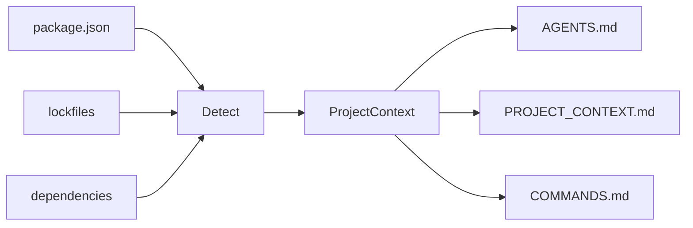
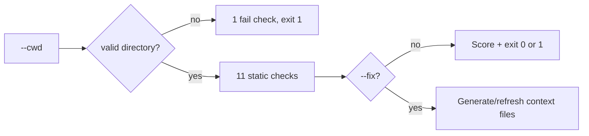

# agent-context-kit

<p align="right">
  <strong>English</strong> · <a href="./README.vi.md">Tiếng Việt</a>
</p>

> **Make any repository AI-agent-ready in 30 seconds.**

A small CLI that scans your Node.js project and generates context files for **Cursor**, **Codex**, **Claude Code**, **Copilot**, and other AI coding agents — so they stop guessing your stack, scripts, and folder layout.

---

## Quick start

```bash
npx agent-context-kit init
```

Preview first (recommended):

```bash
npx agent-context-kit init --dry-run
```

Generate native agent files for Cursor and Claude Code:

```bash
npx agent-context-kit init --cursor
npx agent-context-kit init --claude
npx agent-context-kit init --all
```

Refresh generated context files after your project changes:

```bash
npx agent-context-kit update
npx agent-context-kit update --check
npx agent-context-kit update --check --json
npx agent-context-kit update --all
```

Check whether a project is ready for AI agents (no file writes):

```bash
npx agent-context-kit doctor
npx agent-context-kit doctor --fix --dry-run
npx agent-context-kit doctor --fix
npx agent-context-kit doctor --cwd /path/to/your-project
```

Turn a rough instruction into a compact, agent-ready prompt (no AI API):

```bash
npx agent-context-kit prompt "kiểm tra doctor --json giúp tôi"
npx agent-context-kit prompt --target en "sửa lỗi doctor --json giúp tôi"
echo "review api. run pnpm test" | npx agent-context-kit prompt --stdin --json
```

### Command map

| Command  | Use it when you want to...                              | Writes files?                                   |
| -------- | ------------------------------------------------------- | ----------------------------------------------- |
| `init`   | create context files for a project                      | Yes, unless `--dry-run`                         |
| `update` | refresh generated context after the repo changes        | Yes, unless `--dry-run`, `--check`, or `--json` |
| `doctor` | check whether a project is AI-agent-ready               | Only with `--fix`                               |
| `prompt` | turn a rough instruction into a structured agent prompt | No                                              |

---

## Why this exists

AI agents work best when they already know:

| Without context                    | With `agent-context-kit`               |
| ---------------------------------- | -------------------------------------- |
| Guesses `npm` vs `pnpm`            | Reads lockfile + `package.json`        |
| Invents build/test commands        | Uses real `package.json` scripts       |
| Edits lockfiles by mistake         | `AGENTS.md` lists files to avoid       |
| Re-explains the repo every session | `PROJECT_CONTEXT.md` stays in the repo |

---

## What you get

After `init`, your project root can include:

| File                                  | Purpose                                                       |
| ------------------------------------- | ------------------------------------------------------------- |
| `AGENTS.md`                           | How agents should work in this repo (rules, folders, testing) |
| `PROJECT_CONTEXT.md`                  | Stack, package manager, dependencies, notes                   |
| `COMMANDS.md`                         | Dev, build, test, lint, and related scripts                   |
| `.cursor/rules/agent-context-kit.mdc` | Optional Cursor project rule (`init --cursor` or `--all`)     |
| `CLAUDE.md`                           | Optional Claude Code guidance (`init --claude` or `--all`)    |

```text
my-app/
├── package.json
├── AGENTS.md              ← generated
├── PROJECT_CONTEXT.md     ← generated
└── COMMANDS.md            ← generated
```

---

## Install

**One-off (no install):**

```bash
npx agent-context-kit init
```

**pnpm:**

```bash
pnpm dlx agent-context-kit init
```

**Global:**

```bash
npm install -g agent-context-kit
agent-context-kit init
```

Requires **Node.js 18+**.

---

## Usage

### Generate context (current directory)

```bash
agent-context-kit init
```

### Scan another project

Use an **absolute path** (do not prefix with `cd`):

```bash
agent-context-kit init --cwd /Users/you/projects/my-app
```

### Preview without writing files

```bash
agent-context-kit init --dry-run
```

### Overwrite existing generated files

```bash
agent-context-kit init --force
```

### Generate native agent files

```bash
agent-context-kit init --cursor
agent-context-kit init --claude
agent-context-kit init --all
```

### Refresh generated context files

`update` regenerates selected context files. It refreshes files previously generated by `agent-context-kit`, creates missing selected files, and skips user-authored files unless you pass `--force`.

```bash
agent-context-kit update
agent-context-kit update --dry-run
agent-context-kit update --check
agent-context-kit update --check --json
agent-context-kit update --all
agent-context-kit update --force
agent-context-kit update --cwd /Users/you/projects/my-app
```

### Combine flags

```bash
agent-context-kit init --cwd ./my-app --dry-run
agent-context-kit init --cwd ./my-app --force
```

### CLI options

| Flag           | Description                                                              |
| -------------- | ------------------------------------------------------------------------ |
| `--dry-run`    | Print detected info + full file preview; **does not write** to disk      |
| `--force`      | Overwrite `AGENTS.md`, `PROJECT_CONTEXT.md`, `COMMANDS.md` if they exist |
| `--cursor`     | Also generate `.cursor/rules/agent-context-kit.mdc`                      |
| `--claude`     | Also generate `CLAUDE.md`                                                |
| `--all`        | Generate all optional agent files                                        |
| `--cwd <path>` | Project directory to scan (default: current working directory)           |

### Update options

| Flag           | Description                                                              |
| -------------- | ------------------------------------------------------------------------ |
| `--dry-run`    | Preview refreshed content without writing files                          |
| `--check`      | Check whether selected generated files are current; does not write files |
| `--json`       | Print machine-readable check output; does not write files                |
| `--force`      | Overwrite untracked existing files instead of skipping them              |
| `--cursor`     | Also refresh `.cursor/rules/agent-context-kit.mdc`                       |
| `--claude`     | Also refresh `CLAUDE.md`                                                 |
| `--all`        | Refresh all optional agent files                                         |
| `--cwd <path>` | Project directory to update (default: current working directory)         |

Generated files include a small HTML comment marker with a content hash. `update` uses that marker to tell generated files apart from files you wrote by hand, and skips files whose marker hash no longer matches the file body.

### Validate or fix project readiness (`doctor`)

Runs static checks by default. With `--fix`, it creates missing context files, refreshes stale generated files, and skips user-authored files unless you pass `--force`.

```bash
agent-context-kit doctor
agent-context-kit doctor --fix --dry-run
agent-context-kit doctor --fix
agent-context-kit doctor --fix --json
agent-context-kit doctor --cwd /Users/you/projects/my-app
agent-context-kit doctor --json
```

| Flag           | Description                                                     |
| -------------- | --------------------------------------------------------------- |
| `--cwd <path>` | Project directory to check (default: current working directory) |
| `--json`       | Print machine-readable JSON for CI; no colored text output      |
| `--fix`        | Generate missing files and refresh stale generated files        |
| `--dry-run`    | With `--fix`, preview changes without writing files             |
| `--force`      | With `--fix`, overwrite untracked existing files                |
| `--cursor`     | With `--fix`, include `.cursor/rules/agent-context-kit.mdc`     |
| `--claude`     | With `--fix`, include `CLAUDE.md`                               |
| `--all`        | With `--fix`, include all optional agent files                  |

**Exit code:** `0` when there are no failures; `1` when any check has `fail` status (e.g. missing `package.json`).

If `--cwd` does not exist or is not a directory, `doctor` **stops after the first check** so you see the root cause instead of a long list of misleading warnings.

`doctor --fix` does not fix critical project problems such as missing or invalid `package.json`; resolve those first.

### Structure instructions (`prompt`)

Turn rough instructions into compact, structured prompts — **static only**, no translation model in MVP.

```bash
agent-context-kit prompt "kiểm tra doctor --json giúp tôi"
agent-context-kit prompt --target en "sửa lỗi doctor --json giúp tôi"
agent-context-kit prompt --target vi "Explain what prompt does"
agent-context-kit prompt --stdin
agent-context-kit prompt --file task.txt
agent-context-kit prompt
```

| Flag                      | Description                                               |
| ------------------------- | --------------------------------------------------------- |
| `[text]`                  | Instruction (positional)                                  |
| `--stdin`                 | Read instruction from stdin                               |
| `--file <path>`           | Read instruction from file                                |
| `--target <auto\|en\|vi>` | Set the response language instruction (`auto` by default) |
| `--json`                  | Print JSON instead of Markdown                            |
| `--stats`                 | Print size stats on stderr                                |

**Exit code:** `0` on success; `1` when input is empty after normalization.

`--target` is rule-based. It controls the generated response instruction; it does not call a translation model.

Spec: [`doc/guide/PROMPT_SPEC.md`](./doc/guide/PROMPT_SPEC.md).

For CI, use JSON output:

```bash
agent-context-kit doctor --json
```

```json
{
  "cwd": "/path/to/project",
  "ok": true,
  "score": {
    "passed": 11,
    "warned": 0,
    "failed": 0,
    "total": 11
  },
  "checks": [
    {
      "label": "Project directory found",
      "status": "pass"
    }
  ]
}
```

**Checks (when the directory is valid):**

| Check                                            | `pass`                             | `warn`            | `fail`                     |
| ------------------------------------------------ | ---------------------------------- | ----------------- | -------------------------- |
| Project directory                                | exists and is a directory          | —                 | missing or not a directory |
| `package.json`                                   | found                              | —                 | missing                    |
| `package.json` JSON                              | valid                              | —                 | invalid / unreadable       |
| Package manager                                  | lockfile or `packageManager` field | npm fallback only | —                          |
| `AGENTS.md`, `PROJECT_CONTEXT.md`, `COMMANDS.md` | found                              | missing           | —                          |
| `dev`, `build`, `test` scripts                   | found                              | missing           | —                          |
| `README.md`                                      | found                              | missing           | —                          |

---

## Example terminal output

```text
agent-context-kit

Detected:
- Project: todoist-style-demo
- Package manager: npm
- Framework: React/Vite + Express
- Database: MongoDB/Mongoose
- Scripts: dev, dev:client, dev:server, build

Would generate:
- AGENTS.md
- PROJECT_CONTEXT.md
- COMMANDS.md

──────────────────────────────────────────────
Dry run — no files written.
```

When writing for real:

```text
Generated:
- PROJECT_CONTEXT.md
- COMMANDS.md
Skipped:
- AGENTS.md already exists. Use --force to overwrite.
```

With `--force`:

```text
Overwritten:
- AGENTS.md
Generated:
- PROJECT_CONTEXT.md
- COMMANDS.md
```

`doctor` (wrong `--cwd` — early exit):

```text
agent-context-kit doctor

Checks:
  ✗ Project directory found (/wrong/path does not exist)

Score: 0/1 · 0 warnings · 1 failure
```

`doctor` (valid project, some context files missing):

```text
agent-context-kit doctor

Checks:
  ✓ Project directory found
  ✓ package.json found
  ✓ package.json is valid JSON
  ✓ Package manager detected: npm
  ! AGENTS.md found
  ! PROJECT_CONTEXT.md found
  ! COMMANDS.md found
  ✓ dev script found
  ✓ build script found
  ! test script not found
  ✓ README.md found

Score: 6/11 · 4 warnings · 0 failures
```

---

## What it detects (MVP)

Detection is **static** (from `package.json`, lockfiles, and root folders) — no AI API calls.

### Package manager

Priority: **lockfile** → `package.json` `packageManager` field → **npm** fallback

| Signal                           | Result                |
| -------------------------------- | --------------------- |
| `pnpm-lock.yaml`                 | pnpm                  |
| `yarn.lock`                      | yarn                  |
| `bun.lock` / `bun.lockb`         | bun                   |
| `package-lock.json`              | npm                   |
| `"packageManager": "pnpm@9.0.0"` | pnpm (if no lockfile) |

### Stack (can combine layers)

Each layer picks the **first matching rule** from `dependencies` + `devDependencies`. Multiple layers can appear together (e.g. frontend + backend + database).

| Layer    | Detected labels (in rule order)                                              |
| -------- | ---------------------------------------------------------------------------- |
| Frontend | Next.js, Nuxt, React/Vite, Vue/Vite, React (CRA), React, Vue, Svelte         |
| Backend  | NestJS, Express, Fastify, Koa, Hono                                          |
| Database | MongoDB/Mongoose, MongoDB, Prisma, TypeORM, PostgreSQL, MySQL, SQLite, Redis |

If nothing matches, framework summary falls back to **Node.js**.

Full-stack example: **React/Vite + Express** with **MongoDB/Mongoose**.

### Scripts

Maps these logical script keys (first matching alias in `package.json` wins):

| Key         | Aliases also checked                     |
| ----------- | ---------------------------------------- |
| `dev`       | `start:dev`, `develop`                   |
| `build`     | `build`                                  |
| `test`      | `test`, `test:unit`, `test:run`          |
| `lint`      | `lint`, `eslint`                         |
| `typecheck` | `typecheck`, `type-check`, `check:types` |
| `format`    | `format`, `prettier`, `fmt`              |

Also lists related scripts (e.g. `dev:client`, `dev:server`) when they exist as `dev:*` or are referenced inside the `dev` command.

### Important folders

Checks for: `src/`, `app/`, `pages/`, `components/`, `lib/`, `tests/` (at project root).

---

## Safety defaults

- **Never overwrites** existing `AGENTS.md`, `PROJECT_CONTEXT.md`, or `COMMANDS.md` unless you pass `--force`
- **`--dry-run`** never touches the filesystem
- Skips heavy directories (`node_modules`, `.git`, `dist`, …) when scanning
- Clear errors for missing/invalid `package.json` or bad `--cwd` (`init` and `doctor`)
- `doctor` fails fast when `--cwd` is wrong (no spurious “missing context file” noise)

---

## How it works

**`init`** — detect → generate Markdown:



**`doctor`** — validate; `--fix` can safely repair context files:



**Full specs:** [`doc/guide/README.md`](./doc/guide/README.md) (requirements, CLI, data model, detection rules, architecture).  
Implementation walkthrough: [`doc/guide/SRC_WORKFLOW.md`](./doc/guide/SRC_WORKFLOW.md).

---

## Development

Clone and work on the CLI itself:

```bash
pnpm install
pnpm dev init --dry-run
pnpm dev init --cwd /path/to/your-project --dry-run
pnpm dev doctor --cwd /path/to/your-project
pnpm dev doctor --fix --dry-run --cwd /path/to/your-project
pnpm test
pnpm typecheck
pnpm build
pnpm start init --help
pnpm start doctor --cwd /path/to/your-project
pnpm --silent start doctor --json --cwd /path/to/your-project
```

Release: [CHANGELOG.md](./CHANGELOG.md) · Publish: [PUBLISH_CHECKLIST.md](./PUBLISH_CHECKLIST.md)

---

## Roadmap

- [x] `agent-context-kit doctor` — validate project readiness (static checks, no writes)
- [x] `doctor --fix` — safely generate/refresh context files
- [x] `doctor --json` — machine-readable output for CI
- [x] `agent-context-kit prompt` — structure rough instructions, --file, and interactive mode (no AI API)
- [x] `prompt --target auto|en|vi` — choose response language instruction
- [x] `.cursor/rules` and `CLAUDE.md` optional generators
- [x] `agent-context-kit update` — refresh generated context files after repo changes
- [ ] `prompt --style` (v0.2)
- [ ] `prompt --ai` opt-in rewrite (v0.3)
- [ ] Python / FastAPI / Django support
- [ ] GitHub Action to keep context in sync
- [ ] Optional AI-enhanced summaries

---

## License

[MIT](./LICENSE)
