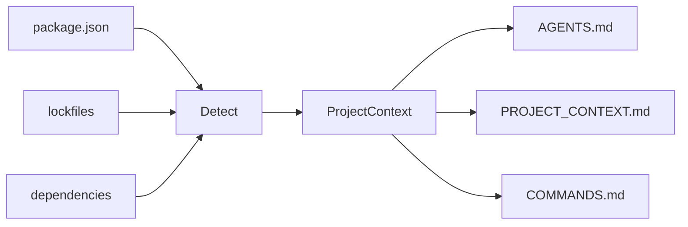
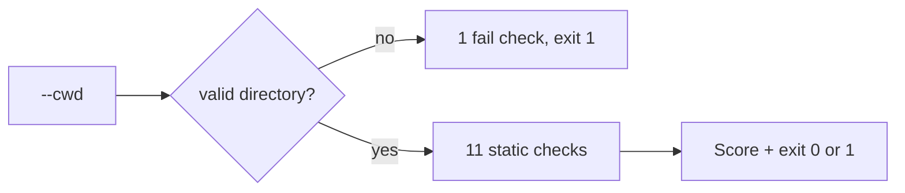

# agent-context-kit

<p align="right">
  <strong>English</strong> · <a href="./README.vi.md">Tiếng Việt</a>
</p>

> **Make any repository AI-agent-ready in 30 seconds.**

A small CLI that scans your Node.js project and generates context files for **Cursor**, **Codex**, **Claude Code**, **Copilot**, and other AI coding agents — so they stop guessing your stack, scripts, and folder layout.

---

## Quick start

```bash
npx agent-context-kit init
```

Preview first (recommended):

```bash
npx agent-context-kit init --dry-run
```

Check whether a project is ready for AI agents (no file writes):

```bash
npx agent-context-kit doctor
npx agent-context-kit doctor --cwd /path/to/your-project
```

---

## Why this exists

AI agents work best when they already know:

| Without context | With `agent-context-kit` |
|-----------------|-------------------------|
| Guesses `npm` vs `pnpm` | Reads lockfile + `package.json` |
| Invents build/test commands | Uses real `package.json` scripts |
| Edits lockfiles by mistake | `AGENTS.md` lists files to avoid |
| Re-explains the repo every session | `PROJECT_CONTEXT.md` stays in the repo |

---

## What you get

After `init`, your project root can include:

| File | Purpose |
|------|---------|
| `AGENTS.md` | How agents should work in this repo (rules, folders, testing) |
| `PROJECT_CONTEXT.md` | Stack, package manager, dependencies, notes |
| `COMMANDS.md` | Dev, build, test, lint, and related scripts |

```text
my-app/
├── package.json
├── AGENTS.md              ← generated
├── PROJECT_CONTEXT.md     ← generated
└── COMMANDS.md            ← generated
```

---

## Install

**One-off (no install):**

```bash
npx agent-context-kit init
```

**pnpm:**

```bash
pnpm dlx agent-context-kit init
```

**Global:**

```bash
npm install -g agent-context-kit
agent-context-kit init
```

Requires **Node.js 18+**.

---

## Usage

### Generate context (current directory)

```bash
agent-context-kit init
```

### Scan another project

Use an **absolute path** (do not prefix with `cd`):

```bash
agent-context-kit init --cwd /Users/you/projects/my-app
```

### Preview without writing files

```bash
agent-context-kit init --dry-run
```

### Overwrite existing generated files

```bash
agent-context-kit init --force
```

### Combine flags

```bash
agent-context-kit init --cwd ./my-app --dry-run
agent-context-kit init --cwd ./my-app --force
```

### CLI options

| Flag | Description |
|------|-------------|
| `--dry-run` | Print detected info + full file preview; **does not write** to disk |
| `--force` | Overwrite `AGENTS.md`, `PROJECT_CONTEXT.md`, `COMMANDS.md` if they exist |
| `--cwd <path>` | Project directory to scan (default: current working directory) |

### Validate project readiness (`doctor`)

Runs static checks only — **does not** generate or modify files.

```bash
agent-context-kit doctor
agent-context-kit doctor --cwd /Users/you/projects/my-app
agent-context-kit doctor --json
```

| Flag | Description |
|------|-------------|
| `--cwd <path>` | Project directory to check (default: current working directory) |
| `--json` | Print machine-readable JSON for CI; no colored text output |

**Exit code:** `0` when there are no failures; `1` when any check has `fail` status (e.g. missing `package.json`).

If `--cwd` does not exist or is not a directory, `doctor` **stops after the first check** so you see the root cause instead of a long list of misleading warnings.

For CI, use JSON output:

```bash
agent-context-kit doctor --json
```

```json
{
  "cwd": "/path/to/project",
  "ok": true,
  "score": {
    "passed": 11,
    "warned": 0,
    "failed": 0,
    "total": 11
  },
  "checks": [
    {
      "label": "Project directory found",
      "status": "pass"
    }
  ]
}
```

**Checks (when the directory is valid):**

| Check | `pass` | `warn` | `fail` |
|-------|--------|--------|--------|
| Project directory | exists and is a directory | — | missing or not a directory |
| `package.json` | found | — | missing |
| `package.json` JSON | valid | — | invalid / unreadable |
| Package manager | lockfile or `packageManager` field | npm fallback only | — |
| `AGENTS.md`, `PROJECT_CONTEXT.md`, `COMMANDS.md` | found | missing | — |
| `dev`, `build`, `test` scripts | found | missing | — |
| `README.md` | found | missing | — |

---

## Example terminal output

```text
agent-context-kit

Detected:
- Project: todoist-style-demo
- Package manager: npm
- Framework: React/Vite + Express
- Database: MongoDB/Mongoose
- Scripts: dev, dev:client, dev:server, build

Would generate:
- AGENTS.md
- PROJECT_CONTEXT.md
- COMMANDS.md

──────────────────────────────────────────────
Dry run — no files written.
```

When writing for real:

```text
Generated:
- PROJECT_CONTEXT.md
- COMMANDS.md
Skipped:
- AGENTS.md already exists. Use --force to overwrite.
```

With `--force`:

```text
Overwritten:
- AGENTS.md
Generated:
- PROJECT_CONTEXT.md
- COMMANDS.md
```

`doctor` (wrong `--cwd` — early exit):

```text
agent-context-kit doctor

Checks:
  ✗ Project directory found (/wrong/path does not exist)

Score: 0/1 · 0 warnings · 1 failure
```

`doctor` (valid project, some context files missing):

```text
agent-context-kit doctor

Checks:
  ✓ Project directory found
  ✓ package.json found
  ✓ package.json is valid JSON
  ✓ Package manager detected: npm
  ! AGENTS.md found
  ! PROJECT_CONTEXT.md found
  ! COMMANDS.md found
  ✓ dev script found
  ✓ build script found
  ! test script not found
  ✓ README.md found

Score: 6/11 · 4 warnings · 0 failures
```

---

## What it detects (MVP)

Detection is **static** (from `package.json`, lockfiles, and root folders) — no AI API calls.

### Package manager

Priority: **lockfile** → `package.json` `packageManager` field → **npm** fallback

| Signal | Result |
|--------|--------|
| `pnpm-lock.yaml` | pnpm |
| `yarn.lock` | yarn |
| `bun.lock` / `bun.lockb` | bun |
| `package-lock.json` | npm |
| `"packageManager": "pnpm@9.0.0"` | pnpm (if no lockfile) |

### Stack (can combine layers)

Each layer picks the **first matching rule** from `dependencies` + `devDependencies`. Multiple layers can appear together (e.g. frontend + backend + database).

| Layer | Detected labels (in rule order) |
|-------|----------------------------------|
| Frontend | Next.js, Nuxt, React/Vite, Vue/Vite, React (CRA), React, Vue, Svelte |
| Backend | NestJS, Express, Fastify, Koa, Hono |
| Database | MongoDB/Mongoose, MongoDB, Prisma, TypeORM, PostgreSQL, MySQL, SQLite, Redis |

If nothing matches, framework summary falls back to **Node.js**.

Full-stack example: **React/Vite + Express** with **MongoDB/Mongoose**.

### Scripts

Maps these logical script keys (first matching alias in `package.json` wins):

| Key | Aliases also checked |
|-----|----------------------|
| `dev` | `start:dev`, `develop` |
| `build` | `build` |
| `test` | `test`, `test:unit`, `test:run` |
| `lint` | `lint`, `eslint` |
| `typecheck` | `typecheck`, `type-check`, `check:types` |
| `format` | `format`, `prettier`, `fmt` |

Also lists related scripts (e.g. `dev:client`, `dev:server`) when they exist as `dev:*` or are referenced inside the `dev` command.

### Important folders

Checks for: `src/`, `app/`, `pages/`, `components/`, `lib/`, `tests/` (at project root).

---

## Safety defaults

- **Never overwrites** existing `AGENTS.md`, `PROJECT_CONTEXT.md`, or `COMMANDS.md` unless you pass `--force`
- **`--dry-run`** never touches the filesystem
- Skips heavy directories (`node_modules`, `.git`, `dist`, …) when scanning
- Clear errors for missing/invalid `package.json` or bad `--cwd` (`init` and `doctor`)
- `doctor` fails fast when `--cwd` is wrong (no spurious “missing context file” noise)

---

## How it works

**`init`** — detect → generate Markdown:



**`doctor`** — validate only (no writes):



**Full specs:** [`doc/guide/README.md`](./doc/guide/README.md) (requirements, CLI, data model, detection rules, architecture).  
Implementation walkthrough: [`doc/guide/SRC_WORKFLOW.md`](./doc/guide/SRC_WORKFLOW.md).

---

## Development

Clone and work on the CLI itself:

```bash
pnpm install
pnpm dev init --dry-run
pnpm dev init --cwd /path/to/your-project --dry-run
pnpm dev doctor --cwd /path/to/your-project
pnpm test
pnpm typecheck
pnpm build
pnpm start init --help
pnpm start doctor --cwd /path/to/your-project
pnpm start doctor --json --cwd /path/to/your-project
```

Release: [CHANGELOG.md](./CHANGELOG.md) · Publish: [PUBLISH_CHECKLIST.md](./PUBLISH_CHECKLIST.md)

---

## Roadmap

- [x] `agent-context-kit doctor` — validate project readiness (static checks, no writes)
- [x] `doctor --json` — machine-readable output for CI
- [ ] `agent-context-kit update` — refresh context after repo changes
- [ ] `.cursor/rules` and `CLAUDE.md` generators
- [ ] Python / FastAPI / Django support
- [ ] GitHub Action to keep context in sync
- [ ] Optional AI-enhanced summaries

---

## License

[MIT](./LICENSE)
