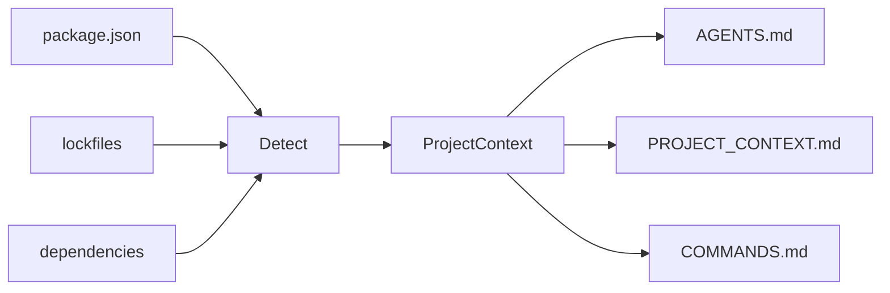
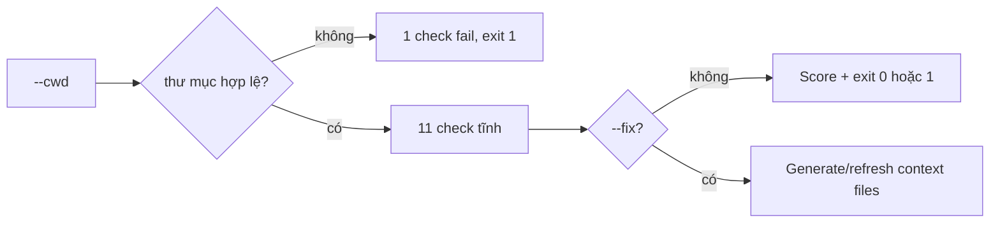

# agent-context-kit

<p align="right">
  <a href="./README.md">English</a> · <strong>Tiếng Việt</strong>
</p>

> **Biến mọi repository thành workspace sẵn sàng cho AI agent trong 30 giây.**

CLI nhỏ quét project Node.js và sinh các file context cho **Cursor**, **Codex**, **Claude Code**, **Copilot** và các AI coding agent khác — để agent không còn đoán stack, script hay cấu trúc thư mục của bạn.

---

## Bắt đầu nhanh

```bash
npx agent-context-kit init
```

Xem trước (nên dùng trước khi ghi file):

```bash
npx agent-context-kit init --dry-run
```

Sinh file native cho Cursor và Claude Code:

```bash
npx agent-context-kit init --cursor
npx agent-context-kit init --claude
npx agent-context-kit init --all
```

Cập nhật lại các file context sau khi project thay đổi:

```bash
npx agent-context-kit update
npx agent-context-kit update --check
npx agent-context-kit update --check --json
npx agent-context-kit update --all
```

Kiểm tra project đã sẵn sàng cho AI agent chưa (không ghi file):

```bash
npx agent-context-kit doctor
npx agent-context-kit doctor --fix --dry-run
npx agent-context-kit doctor --fix
npx agent-context-kit doctor --cwd /path/to/your-project
```

Biến instruction thô thành prompt gọn, sẵn sàng cho agent (không gọi AI API):

```bash
npx agent-context-kit prompt "kiểm tra doctor --json giúp tôi"
npx agent-context-kit prompt --target en "sửa lỗi doctor --json giúp tôi"
echo "review api. chạy pnpm test" | npx agent-context-kit prompt --stdin --json
```

### Bảng lệnh nhanh

| Lệnh     | Dùng khi bạn muốn...                           | Có ghi file không?                            |
| -------- | ---------------------------------------------- | --------------------------------------------- |
| `init`   | tạo context files cho project                  | Có, trừ khi dùng `--dry-run`                  |
| `update` | refresh context đã sinh sau khi repo thay đổi  | Có, trừ `--dry-run`, `--check`, hoặc `--json` |
| `doctor` | kiểm tra project đã sẵn sàng cho AI agent chưa | Chỉ khi dùng `--fix`                          |
| `prompt` | biến instruction thô thành prompt có cấu trúc  | Không                                         |

---

## Vì sao cần tool này?

AI agent hoạt động tốt hơn khi đã biết sẵn:

| Không có context                     | Với `agent-context-kit`                  |
| ------------------------------------ | ---------------------------------------- |
| Đoán `npm` hay `pnpm`                | Đọc lockfile + `package.json`            |
| Bịa lệnh build/test                  | Dùng script thật trong `package.json`    |
| Sửa nhầm lockfile                    | `AGENTS.md` ghi rõ file không nên đụng   |
| Mỗi session phải giải thích lại repo | `PROJECT_CONTEXT.md` nằm ngay trong repo |

---

## Bạn nhận được gì?

Sau `init`, thư mục gốc project có thể có:

| File                                  | Mục đích                                                      |
| ------------------------------------- | ------------------------------------------------------------- |
| `AGENTS.md`                           | Cách agent làm việc trong repo (quy tắc, folder, test)        |
| `PROJECT_CONTEXT.md`                  | Stack, package manager, dependencies, ghi chú                 |
| `COMMANDS.md`                         | Lệnh dev, build, test, lint và script liên quan               |
| `.cursor/rules/agent-context-kit.mdc` | Cursor project rule tùy chọn (`init --cursor` hoặc `--all`)   |
| `CLAUDE.md`                           | Hướng dẫn Claude Code tùy chọn (`init --claude` hoặc `--all`) |

```text
my-app/
├── package.json
├── AGENTS.md              ← sinh tự động
├── PROJECT_CONTEXT.md     ← sinh tự động
└── COMMANDS.md            ← sinh tự động
```

---

## Cài đặt

**Chạy một lần (không cần cài global):**

```bash
npx agent-context-kit init
```

**pnpm:**

```bash
pnpm dlx agent-context-kit init
```

**Cài global:**

```bash
npm install -g agent-context-kit
agent-context-kit init
```

Yêu cầu **Node.js 18+**.

---

## Cách dùng

### Sinh context (thư mục hiện tại)

```bash
agent-context-kit init
```

### Quét project khác

Dùng **đường dẫn tuyệt đối** (không gõ `cd` vào `--cwd`):

```bash
agent-context-kit init --cwd /Users/you/projects/my-app
```

### Chỉ xem trước, không ghi file

```bash
agent-context-kit init --dry-run
```

### Ghi đè file đã sinh trước đó

```bash
agent-context-kit init --force
```

### Sinh file native cho agent

```bash
agent-context-kit init --cursor
agent-context-kit init --claude
agent-context-kit init --all
```

### Cập nhật file context đã sinh

`update` regenerate các file context được chọn. Lệnh này refresh file đã được `agent-context-kit` sinh trước đó, tạo file còn thiếu, và bỏ qua file user tự viết trừ khi bạn truyền `--force`.

```bash
agent-context-kit update
agent-context-kit update --dry-run
agent-context-kit update --check
agent-context-kit update --check --json
agent-context-kit update --all
agent-context-kit update --force
agent-context-kit update --cwd /Users/you/projects/my-app
```

### Kết hợp flag

```bash
agent-context-kit init --cwd ./my-app --dry-run
agent-context-kit init --cwd ./my-app --force
```

### Tùy chọn CLI

| Flag           | Mô tả                                                                  |
| -------------- | ---------------------------------------------------------------------- |
| `--dry-run`    | In thông tin detect + preview đầy đủ; **không ghi** ra disk            |
| `--force`      | Ghi đè `AGENTS.md`, `PROJECT_CONTEXT.md`, `COMMANDS.md` nếu đã tồn tại |
| `--cursor`     | Sinh thêm `.cursor/rules/agent-context-kit.mdc`                        |
| `--claude`     | Sinh thêm `CLAUDE.md`                                                  |
| `--all`        | Sinh toàn bộ file agent tùy chọn                                       |
| `--cwd <path>` | Thư mục project cần quét (mặc định: thư mục làm việc hiện tại)         |

### Tùy chọn update

| Flag           | Mô tả                                                              |
| -------------- | ------------------------------------------------------------------ |
| `--dry-run`    | Preview nội dung refresh, không ghi file                           |
| `--check`      | Kiểm tra file generated đã cập nhật chưa; không ghi file           |
| `--json`       | In kết quả check dạng machine-readable; không ghi file             |
| `--force`      | Ghi đè file hiện có nhưng không có marker generated                |
| `--cursor`     | Refresh thêm `.cursor/rules/agent-context-kit.mdc`                 |
| `--claude`     | Refresh thêm `CLAUDE.md`                                           |
| `--all`        | Refresh toàn bộ file agent tùy chọn                                |
| `--cwd <path>` | Thư mục project cần cập nhật (mặc định: thư mục làm việc hiện tại) |

File generated có một HTML comment marker nhỏ kèm hash nội dung. `update` dùng marker này để phân biệt file do tool sinh với file bạn tự viết tay, và skip file có hash marker không còn khớp body.

### Kiểm tra hoặc sửa readiness (`doctor`)

Mặc định chỉ chạy check tĩnh. Khi có `--fix`, lệnh sẽ tạo file context còn thiếu, refresh file generated đã cũ, và bỏ qua file user tự viết trừ khi bạn truyền `--force`.

```bash
agent-context-kit doctor
agent-context-kit doctor --fix --dry-run
agent-context-kit doctor --fix
agent-context-kit doctor --fix --json
agent-context-kit doctor --cwd /Users/you/projects/my-app
agent-context-kit doctor --json
```

| Flag           | Mô tả                                                              |
| -------------- | ------------------------------------------------------------------ |
| `--cwd <path>` | Thư mục project cần kiểm tra (mặc định: thư mục làm việc hiện tại) |
| `--json`       | In JSON machine-readable cho CI; không in text màu                 |
| `--fix`        | Tạo file thiếu và refresh file generated đã cũ                     |
| `--dry-run`    | Với `--fix`, preview thay đổi mà không ghi file                    |
| `--force`      | Với `--fix`, ghi đè file existing không có marker generated        |
| `--cursor`     | Với `--fix`, include `.cursor/rules/agent-context-kit.mdc`         |
| `--claude`     | Với `--fix`, include `CLAUDE.md`                                   |
| `--all`        | Với `--fix`, include toàn bộ file agent tùy chọn                   |

**Exit code:** `0` khi không có check `fail`; `1` khi có ít nhất một `fail` (ví dụ thiếu `package.json`).

Nếu `--cwd` không tồn tại hoặc không phải thư mục, `doctor` **dừng sau check đầu tiên** — báo đúng gốc lỗi, không liệt kê hàng loạt warn “thiếu context file” gây hiểu nhầm.

`doctor --fix` không sửa lỗi project critical như thiếu hoặc hỏng `package.json`; bạn cần xử lý các lỗi đó trước.

### Cấu trúc instruction (`prompt`)

Biến instruction thô thành prompt gọn, có cấu trúc — **chỉ xử lý tĩnh**, MVP chưa dùng model dịch.

```bash
agent-context-kit prompt "kiểm tra doctor --json giúp tôi"
agent-context-kit prompt --target en "sửa lỗi doctor --json giúp tôi"
agent-context-kit prompt --target vi "Explain what prompt does"
agent-context-kit prompt --stdin
agent-context-kit prompt --file task.txt
agent-context-kit prompt
```

| Flag                      | Mô tả                                                         |
| ------------------------- | ------------------------------------------------------------- |
| `[text]`                  | Instruction (tham số vị trí)                                  |
| `--stdin`                 | Đọc instruction từ stdin                                      |
| `--file <path>`           | Đọc instruction từ file                                       |
| `--target <auto\|en\|vi>` | Chọn instruction ngôn ngữ cho phần response (`auto` mặc định) |
| `--json`                  | In JSON thay vì Markdown                                      |
| `--stats`                 | In thống kê độ dài ra stderr                                  |

**Exit code:** `0` khi thành công; `1` khi input rỗng sau normalize.

`--target` vẫn là rule-based. Flag này điều khiển instruction ngôn ngữ trong prompt output; không gọi model dịch.

Spec: [`doc/guide/PROMPT_SPEC.md`](./doc/guide/PROMPT_SPEC.md).

Dùng JSON output cho CI:

```bash
agent-context-kit doctor --json
```

```json
{
  "cwd": "/path/to/project",
  "ok": true,
  "score": {
    "passed": 11,
    "warned": 0,
    "failed": 0,
    "total": 11
  },
  "checks": [
    {
      "label": "Project directory found",
      "status": "pass"
    }
  ]
}
```

**Các check (khi thư mục hợp lệ):**

| Check                                            | `pass`                               | `warn`           | `fail`                               |
| ------------------------------------------------ | ------------------------------------ | ---------------- | ------------------------------------ |
| Thư mục project                                  | tồn tại và là directory              | —                | không tồn tại / không phải directory |
| `package.json`                                   | có                                   | —                | thiếu                                |
| JSON `package.json`                              | hợp lệ                               | —                | sai / không đọc được                 |
| Package manager                                  | lockfile hoặc field `packageManager` | chỉ fallback npm | —                                    |
| `AGENTS.md`, `PROJECT_CONTEXT.md`, `COMMANDS.md` | có                                   | thiếu            | —                                    |
| script `dev`, `build`, `test`                    | có                                   | thiếu            | —                                    |
| `README.md`                                      | có                                   | thiếu            | —                                    |

---

## Ví dụ output terminal

```text
agent-context-kit

Detected:
- Project: todoist-style-demo
- Package manager: npm
- Framework: React/Vite + Express
- Database: MongoDB/Mongoose
- Scripts: dev, dev:client, dev:server, build

Would generate:
- AGENTS.md
- PROJECT_CONTEXT.md
- COMMANDS.md

──────────────────────────────────────────────
Dry run — no files written.
```

Khi ghi file thật:

```text
Generated:
- PROJECT_CONTEXT.md
- COMMANDS.md
Skipped:
- AGENTS.md already exists. Use --force to overwrite.
```

Với `--force`:

```text
Overwritten:
- AGENTS.md
Generated:
- PROJECT_CONTEXT.md
- COMMANDS.md
```

`doctor` (`--cwd` sai — dừng sớm):

```text
agent-context-kit doctor

Checks:
  ✗ Project directory found (/wrong/path does not exist)

Score: 0/1 · 0 warnings · 1 failure
```

`doctor` (project hợp lệ, thiếu vài file context):

```text
agent-context-kit doctor

Checks:
  ✓ Project directory found
  ✓ package.json found
  ✓ package.json is valid JSON
  ✓ Package manager detected: npm
  ! AGENTS.md found
  ! PROJECT_CONTEXT.md found
  ! COMMANDS.md found
  ✓ dev script found
  ✓ build script found
  ! test script not found
  ✓ README.md found

Score: 6/11 · 4 warnings · 0 failures
```

---

## Tool detect được gì (MVP)

Phân tích **tĩnh** (từ `package.json`, lockfile, folder gốc) — **không** gọi AI API.

### Package manager

Thứ tự ưu tiên: **lockfile** → field `packageManager` trong `package.json` → mặc định **npm**

| Tín hiệu                         | Kết quả                      |
| -------------------------------- | ---------------------------- |
| `pnpm-lock.yaml`                 | pnpm                         |
| `yarn.lock`                      | yarn                         |
| `bun.lock` / `bun.lockb`         | bun                          |
| `package-lock.json`              | npm                          |
| `"packageManager": "pnpm@9.0.0"` | pnpm (khi không có lockfile) |

### Stack (có thể kết hợp nhiều lớp)

Mỗi lớp chọn **rule khớp đầu tiên** từ `dependencies` + `devDependencies`. Nhiều lớp có thể cùng xuất hiện (frontend + backend + database).

| Lớp      | Nhãn detect (theo thứ tự rule)                                               |
| -------- | ---------------------------------------------------------------------------- |
| Frontend | Next.js, Nuxt, React/Vite, Vue/Vite, React (CRA), React, Vue, Svelte         |
| Backend  | NestJS, Express, Fastify, Koa, Hono                                          |
| Database | MongoDB/Mongoose, MongoDB, Prisma, TypeORM, PostgreSQL, MySQL, SQLite, Redis |

Không khớp rule nào → framework summary mặc định **Node.js**.

Ví dụ full-stack: **React/Vite + Express** với **MongoDB/Mongoose**.

### Scripts

Map các key logic (alias đầu tiên có trong `package.json` được dùng):

| Key         | Alias cũng được kiểm tra                 |
| ----------- | ---------------------------------------- |
| `dev`       | `start:dev`, `develop`                   |
| `build`     | `build`                                  |
| `test`      | `test`, `test:unit`, `test:run`          |
| `lint`      | `lint`, `eslint`                         |
| `typecheck` | `typecheck`, `type-check`, `check:types` |
| `format`    | `format`, `prettier`, `fmt`              |

Cũng liệt kê script liên quan (`dev:client`, `dev:server`, …) nếu có prefix `dev:*` hoặc được gọi trong lệnh `dev`.

### Folder quan trọng

Kiểm tra ở root: `src/`, `app/`, `pages/`, `components/`, `lib/`, `tests/`.

---

## Mặc định an toàn

- **Không ghi đè** `AGENTS.md`, `PROJECT_CONTEXT.md`, `COMMANDS.md` trừ khi có `--force`
- **`--dry-run`** không đụng filesystem
- Bỏ qua thư mục nặng (`node_modules`, `.git`, `dist`, …) khi quét
- Báo lỗi rõ khi thiếu/sai `package.json` hoặc `--cwd` không hợp lệ (`init`, `update`, `doctor`)
- `doctor` dừng sớm khi `--cwd` sai (tránh warn “thiếu file context” gây nhiễu)

---

## Cách hoạt động

**`init`** — detect → sinh Markdown:



**`doctor`** — validate; `--fix` có thể sửa context files an toàn:



**Đặc tả đầy đủ:** [`doc/guide/README.md`](./doc/guide/README.md) (yêu cầu, CLI, mô hình dữ liệu, rule detect, kiến trúc).  
Chi tiết mã nguồn: [`doc/guide/SRC_WORKFLOW.md`](./doc/guide/SRC_WORKFLOW.md).

---

## Phát triển

Clone và làm việc trên CLI:

```bash
pnpm install
pnpm dev init --dry-run
pnpm dev init --cwd /path/to/your-project --dry-run
pnpm dev doctor --cwd /path/to/your-project
pnpm dev doctor --fix --dry-run --cwd /path/to/your-project
pnpm test
pnpm typecheck
pnpm build
pnpm start init --help
pnpm start doctor --cwd /path/to/your-project
pnpm --silent start doctor --json --cwd /path/to/your-project
```

Phát hành: [CHANGELOG.md](./CHANGELOG.md) · Publish: [PUBLISH_CHECKLIST.md](./PUBLISH_CHECKLIST.md)

---

## Roadmap

- [x] `agent-context-kit doctor` — kiểm tra project sẵn sàng cho agent (check tĩnh, không ghi file)
- [x] `doctor --fix` — tạo/refresh context files an toàn
- [x] `doctor --json` — output JSON cho CI
- [x] `agent-context-kit prompt` — cấu trúc instruction thô, hỗ trợ `--file` và interactive mode (không AI API)
- [x] `prompt --target auto|en|vi` — chọn instruction ngôn ngữ cho response
- [x] Sinh `.cursor/rules` và `CLAUDE.md` tùy chọn
- [x] `agent-context-kit update` — refresh context sau khi repo thay đổi
- [ ] `prompt --style` (v0.2)
- [ ] `prompt --ai` rewrite tùy chọn (v0.3)
- [ ] Hỗ trợ Python / FastAPI / Django
- [ ] GitHub Action đồng bộ context
- [ ] Tùy chọn tóm tắt bằng AI

---

## Giấy phép

[MIT](./LICENSE)
