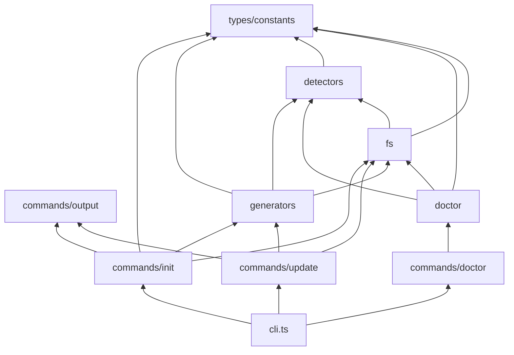

# Kiến trúc hệ thống

CLI **agent-context-kit** theo mô hình **pipeline tĩnh**: đọc disk → model nội bộ → output (file hoặc report).

---

## 1. Layered view

```text
┌─────────────────────────────────────────────────────────┐
│  Presentation (CLI)                                      │
│  cli.ts · picocolors · commander                         │
├─────────────────────────────────────────────────────────┤
│  Application                                             │
│  commands/init.ts · commands/update.ts · commands/doctor │
│  commands/prompt.ts · commands/output                    │
├─────────────────────────────────────────────────────────┤
│  Domain                                                  │
│  doctor/checks · doctor/score                            │
│  generators/* · detectors/*                              │
├─────────────────────────────────────────────────────────┤
│  Infrastructure                                          │
│  fs/read-project · fs/write-files · fs/validate          │
├─────────────────────────────────────────────────────────┤
│  Types & constants                                       │
│  types.ts · constants.ts                                 │
└─────────────────────────────────────────────────────────┘
```

---

## 2. Module dependency (allowed direction)



**Quy tắc:**

- `generators` không import `commands` hay `cli`.
- `detectors` không import `generators`.
- `doctor` không import `generators` (chỉ overlap detect PM qua `detectors`).

---

## 3. Pipelines

### 3.1 Init pipeline

```text
validateInitTarget
  → readProject → ProjectContext
  → generateAllFiles → GeneratedFiles
  → writeGeneratedFiles | printDryRunPreview
```

### 3.2 Doctor pipeline

```text
resolve(cwd)
  → runDoctorChecks → DoctorResult
  → formatCheckLine × N + formatScore
  → exit code from hasCriticalFailure
```

Không share `ProjectContext` giữa hai pipeline (doctor không gọi `readProject` full).

### 3.3 Update pipeline

```text
validateInitTarget
  → readProject → ProjectContext
  → generateAllFiles → GeneratedFiles with marker/hash
  → checkGeneratedFiles
  → JSON/text check | dry-run preview | write tracked files
```

`update` chỉ overwrite file có generated marker hợp lệ. File không có marker, marker sai path, hoặc hash lệch body được xem là user-authored/untracked và skip trừ khi có `--force`.

---

## 4. Extension points

| Muốn thêm        | Chạm module                                                             |
| ---------------- | ----------------------------------------------------------------------- |
| Lệnh CLI mới     | `cli.ts` + `commands/`                                                  |
| Check doctor     | `doctor/checks.ts`                                                      |
| Rule stack       | `detectors/stack.ts` + tests                                            |
| Section Markdown | `generators/*.ts`                                                       |
| Output file mới  | `types.OUTPUT_FILES` + generator + marker/update + write-files + doctor |

---

## 5. Build & distribution

| Artifact          | Mô tả                                                    |
| ----------------- | -------------------------------------------------------- |
| `dist/`           | `tsc` output; `bin` → `dist/cli.js`                      |
| `doc/guide/`      | Đặc tả (README trong repo + tarball npm)                 |
| `CHANGELOG.md`    | Lịch sử phiên bản (trong `files`)                        |
| `files` field npm | `dist`, `doc/guide`, `CHANGELOG.md` (xem `package.json`) |

npm **luôn** đính kèm `README.md`, `README.vi.md`, `LICENSE`, và `package.json` dù không liệt kê trong `files`. Publish checklist: [PUBLISH_CHECKLIST.md](../../PUBLISH_CHECKLIST.md). Link tương đối trong README tới `./doc/guide/...` hoạt động trên npmjs.com vì `doc/guide` nằm trong tarball.

Runtime user: `npx agent-context-kit` hoặc global install — không cần `src/`; có thể đọc docs tại `node_modules/agent-context-kit/doc/guide/`.

---

## 6. Testing architecture

- **Unit:** detectors, doctor checks, validation (vitest).
- **Fixture:** `mkdtempSync` + `package.json` tạm (`tests/doctor.test.ts`, init-safety).
- **Generator contract:** Markdown spacing, fallback labels, trailing newline (`tests/generators.test.ts`).
- **Không có:** E2E subprocess CLI trong CI (có thể thêm sau).

Xem [TEST_STRATEGY.md](./TEST_STRATEGY.md).

---

## 7. ADR

Quyết định kiến trúc ghi tại [adr/](./adr/).
