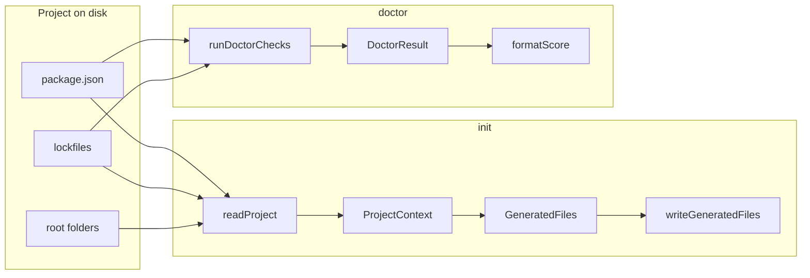

# Mô hình dữ liệu

Nguồn truth trong code: `src/types.ts`.

---

## 1. Luồng dữ liệu tổng quát



---

## 2. `ProjectContext`

Object trung tâm sau khi quét project (lệnh `init`).

```ts
type ProjectContext = {
  cwd: string;                              // absolute path
  name: string;                             // package.json name
  packageManager: PackageManager;           // npm | pnpm | yarn | bun
  packageManagerSource: PackageManagerSource; // lockfile | package.json | fallback
  stack: ProjectStack;
  scripts: Record<string, string>;         // raw package.json scripts
  folders: string[];                        // subset of IMPORTANT_FOLDERS
  dependencies: Record<string, string>;
  devDependencies: Record<string, string>;
};
```

**Tạo bởi:** `readProject(cwd)` trong `fs/read-project.ts`.

**Tiêu thụ bởi:** `generateAllFiles(ctx)` → generators.

---

## 3. `ProjectStack` & `StackLayer`

```ts
type StackLayer = {
  label: string;      // e.g. "React/Vite"
  source: string[];   // e.g. ["vite", "react"]
};

type ProjectStack = {
  frontend?: StackLayer;
  backend?: StackLayer;
  database?: StackLayer;
};
```

- Mỗi layer: **rule đầu tiên khớp** trong mảng rule (xem [DETECTION_RULES.md](./DETECTION_RULES.md)).
- `stackFrameworkSummary`: `frontend + backend` hoặc `"Node.js"`.
- `stackDatabaseSummary`: label database layer nếu có.

---

## 4. Scripts (logical keys)

```ts
type ScriptKey =
  | "dev" | "build" | "test" | "lint" | "typecheck" | "format";

const SCRIPT_KEYS: ScriptKey[]; // thứ tự cố định
```

`pickCommonScripts(scripts)` → map `ScriptKey` → `{ scriptName, command }` (alias đầu tiên khớp).

`ctx.scripts` giữ **toàn bộ** scripts từ `package.json`; không bị filter.

---

## 5. Generated output

```ts
type GeneratedFiles = {
  "AGENTS.md": string;
  "PROJECT_CONTEXT.md": string;
  "COMMANDS.md": string;
};

const OUTPUT_FILES = ["AGENTS.md", "PROJECT_CONTEXT.md", "COMMANDS.md"] as const;
type OutputFile = (typeof OUTPUT_FILES)[number];
```

**Sinh bởi:** `generateAllFiles(ctx)` — `generators/index.ts`.

**Ghi bởi:** `writeGeneratedFiles(cwd, files, { force })` → `WriteResult`:

```ts
type WriteResult = {
  created: OutputFile[];
  overwritten: OutputFile[];
  skipped: OutputFile[];
};
```

**Dry-run:** `planWriteActions(cwd, force)` — không tạo `GeneratedFiles` trên disk.

---

## 6. Doctor model

```ts
type DoctorCheckStatus = "pass" | "warn" | "fail";

type DoctorCheck = {
  label: string;
  status: DoctorCheckStatus;
  detail?: string;
};

type DoctorResult = {
  checks: DoctorCheck[];
  passed: number;
  warned: number;
  failed: number;
  total: number;
};
```

**Tạo bởi:** `runDoctorChecks(cwd)` — `doctor/checks.ts`.

**Đếm:** `summarize(checks)` — mỗi check đóng góp đúng một bucket.

**Critical failure:** `hasCriticalFailure(result)` ⇔ `failed > 0`.

### JSON output (`doctor --json`)

CLI map `DoctorResult` → object in `formatDoctorJson()` (`commands/doctor.ts`):

```ts
{
  cwd: string;
  ok: boolean;  // !hasCriticalFailure(result)
  score: { passed, warned, failed, total };
  checks: DoctorCheck[];
}
```

Chi tiết FR: [REQUIREMENTS.md § FR-doctor-8](./REQUIREMENTS.md#fr-doctor-8--json-output).

---

## 7. Package manager resolution

```ts
type PackageManager = "npm" | "pnpm" | "yarn" | "bun";
type PackageManagerSource = "lockfile" | "package.json" | "fallback";

type ResolvedPackageManager = {
  manager: PackageManager;
  source: PackageManagerSource;
};
```

**Hàm:** `resolvePackageManager(cwd, packageManagerField?)`.

---

## 8. Validation errors (init)

`src/fs/validate.ts`:

| Hàm | Dùng khi |
|-----|----------|
| `validateCwd(cwd)` | Directory tồn tại + là folder |
| `validatePackageJsonFile(cwd)` | File package.json tồn tại |
| `parsePackageJsonRaw(raw, path)` | Parse JSON + root object |

`validateInitTarget` (read-project) gộp các bước trên cho `init`.

`doctor` duplicate logic cwd bằng `existsSync` + `statSync` (fail-fast, label riêng cho UX).

---

## 9. Public exports (`index.ts`)

| Export | Module |
|--------|--------|
| `runInit` | `commands/init.js` |
| `runDoctor` | `commands/doctor.js` |
| `runDoctorChecks`, `formatScore`, `hasCriticalFailure` | `doctor/*` |
| `readProject`, `resolveProjectCwd`, `validateInitTarget` | `fs/read-project.js` |
| `generateAllFiles` | `generators/index.js` |
| Detectors | `detectors/*` |
| Types | `types.js` |

CLI không bắt buộc import `index.ts`; dùng `cli.ts` trực tiếp.

---

## 10. Không lưu trữ

- Không database / cache giữa lần chạy.
- Không file config user (`~/.agent-context-kit`).
- Không state trong memory ngoài một lần invoke CLI.
