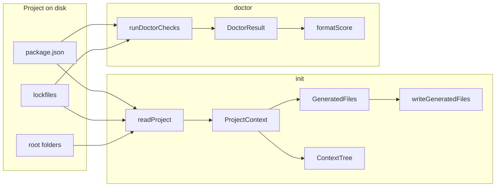

# Mô hình dữ liệu

Nguồn truth trong code: `src/types.ts`.

---

## 1. Luồng dữ liệu tổng quát



---

## 2. `ProjectContext`

Object trung tâm sau khi quét project (lệnh `init`).

```ts
type ProjectContext = {
  cwd: string; // absolute path
  name: string; // package.json name
  packageManager: PackageManager; // npm | pnpm | yarn | bun
  packageManagerSource: PackageManagerSource; // lockfile | package.json | fallback
  stack: ProjectStack;
  scripts: Record<string, string>; // raw package.json scripts
  folders: string[]; // subset of IMPORTANT_FOLDERS
  dependencies: Record<string, string>;
  devDependencies: Record<string, string>;
};
```

**Tạo bởi:** `readProject(cwd)` trong `fs/read-project.ts`.

**Tiêu thụ bởi:** `generateAllFiles(ctx)` → generators.

---

## 3. `ProjectStack` & `StackLayer`

```ts
type StackLayer = {
  label: string; // e.g. "React/Vite"
  source: string[]; // e.g. ["vite", "react"]
};

type ProjectStack = {
  frontend?: StackLayer;
  backend?: StackLayer;
  database?: StackLayer;
};
```

- Mỗi layer: **rule đầu tiên khớp** trong mảng rule (xem [DETECTION_RULES.md](./DETECTION_RULES.md)).
- `stackFrameworkSummary`: `frontend + backend` hoặc `"Node.js"`.
- `stackDatabaseSummary`: label database layer nếu có.

---

## 4. Scripts (logical keys)

```ts
type ScriptKey = "dev" | "build" | "test" | "lint" | "typecheck" | "format";

const SCRIPT_KEYS: ScriptKey[]; // thứ tự cố định
```

`pickCommonScripts(scripts)` → map `ScriptKey` → `{ scriptName, command }` (alias đầu tiên khớp).

`ctx.scripts` giữ **toàn bộ** scripts từ `package.json`; không bị filter.

---

## 5. Generated output

```ts
type GeneratedFiles = {
  "AGENTS.md": string;
  "PROJECT_CONTEXT.md": string;
  "COMMANDS.md": string;
  ".cursor/rules/ready-for-agents.mdc"?: string;
  "CLAUDE.md"?: string;
  ".github/copilot-instructions.md"?: string;
  ".github/workflows/ready-for-agents.yml"?: string;
};

const OUTPUT_FILES = [
  "AGENTS.md",
  "PROJECT_CONTEXT.md",
  "COMMANDS.md",
  ".cursor/rules/ready-for-agents.mdc",
  "CLAUDE.md",
  ".github/copilot-instructions.md",
  ".github/workflows/ready-for-agents.yml",
] as const;
type OutputFile = (typeof OUTPUT_FILES)[number];
```

**Sinh bởi:** `generateAllFiles(ctx)` — `generators/index.ts`.
Optional files are included when `init --cursor`, `init --claude`, `init --copilot`, or `init --all` is used. The GitHub Actions workflow is generated by `rfa ci`.

Mỗi string có generated marker ở cuối file:

```ts
type GeneratedMarker = {
  file: OutputFile;
  hash: string; // first 16 hex chars of sha256(strippedContent)
};
```

Marker được xử lý bởi `generators/marker.ts`:

- `withGeneratedMarker(file, content)`
- `stripGeneratedMarker(content)`
- `readGeneratedMarker(content)`
- `hasGeneratedMarker(content, file)`

`hasGeneratedMarker` chỉ `true` khi marker tồn tại, `file` khớp output path, và `hash` khớp body hiện tại. Nếu user sửa body nhưng để nguyên marker cũ, file sẽ bị xem là `untracked`.

**Ghi bởi:** `writeGeneratedFiles(cwd, files, { force })` → `WriteResult`:

```ts
type WriteResult = {
  created: OutputFile[];
  overwritten: OutputFile[];
  skipped: OutputFile[];
};
```

**Dry-run:** `planWriteActions(cwd, force)` — không tạo `GeneratedFiles` trên disk.

### Update check model

`commands/update.ts` phân loại selected files bằng marker hợp lệ:

```ts
type UpdateCheckJsonOutput = {
  cwd: string;
  ok: boolean;
  upToDate: OutputFile[];
  outdated: OutputFile[];
  missing: OutputFile[];
  untracked: OutputFile[];
};
```

`ok === true` khi `outdated`, `missing`, và `untracked` đều rỗng.

Write mode của `update`:

- Tạo file `missing`.
- Overwrite file `outdated` nếu có marker đúng file.
- Skip file `untracked` trừ khi có `--force`.

---

## 6. Config model

Nguồn truth: `src/config/types.ts`.

```ts
type ReadyForAgentsConfig = {
  $schema?: string;
  files?: {
    cursor?: boolean;
    claude?: boolean;
    all?: boolean;
    index?: boolean;
  };
  doctor?: {
    fix?: {
      cursor?: boolean;
      claude?: boolean;
      all?: boolean;
      force?: boolean;
      index?: boolean;
    };
  };
  prompt?: {
    target?: "auto" | "en" | "vi";
    context?: boolean;
    style?: "standard" | "compact";
    contextLimit?: number;
  };
  index?: {
    output?: string;
  };
};
```

Resolved form (`ResolvedReadyForAgentsConfig`) luôn có boolean/string đầy đủ và dùng fallback:

- `files.index`: `true`
- `doctor.fix.index`: `true`
- `prompt.target`: `auto`
- `prompt.context`: `false`
- `prompt.style`: `standard`
- `prompt.contextLimit`: `5`
- `index.output`: `.ready-for-agents/context-tree.json`

Config primary: `.ready-for-agents.json`.

Legacy config `.agent-context-kit.json` vẫn được đọc nếu primary không tồn tại.

---

## 7. Context tree model

Nguồn truth: `src/indexer/context-tree.ts`.

```ts
type ContextTree = {
  version: 1;
  tool: "ready-for-agents";
  project: {
    name: string;
    cwd: string;
    packageManager: string;
  };
  summary: {
    filesIndexed: number;
    filesMissing: number;
    sectionsIndexed: number;
    tokensEstimate: number;
  };
  files: ContextTreeFile[];
};

type ContextTreeFile = {
  path: OutputFile;
  kind: "core" | "cursor" | "claude" | "copilot" | "ci";
  exists: boolean;
  hash?: string;
  bytes?: number;
  tokensEstimate: number;
  sections: ContextTreeSection[];
};

type ContextTreeSection = {
  id: string;
  heading: string;
  slug: string;
  anchor: string;
  level: number;
  lineStart: number;
  lineEnd: number;
  hash: string;
  words: number;
  tokensEstimate: number;
  keywords: string[];
  commands: string[];
  importance: "high" | "medium" | "low";
  summary: string;
};
```

`rfa index` ghi JSON này vào `.ready-for-agents/context-tree.json` mặc định.

Mục tiêu: agent/CI có thể đọc tree nhỏ trước, biết file nào tồn tại, section nào có nội dung, hash nào thay đổi, section nào quan trọng, command nào liên quan, và ước lượng token nào đáng đọc tiếp.

---

## 8. Query model

Nguồn truth: `src/query/select.ts`, `src/commands/query.ts`.

```ts
type QueryMatch = {
  file: ContextTreeFile["path"];
  sectionId: string;
  heading: string;
  anchor: string;
  lineStart: number;
  lineEnd: number;
  score: number;
  tokensEstimate: number;
  importance: ContextTreeSection["importance"];
  summary: string;
  commands: string[];
  reasons: string[];
};

type QueryJsonOutput =
  | {
      ok: true;
      cwd: string;
      query: string;
      source: "cache" | "live";
      treePath: string;
      summary: ContextTree["summary"];
      matches: QueryMatch[];
    }
  | {
      ok: false;
      cwd: string;
      query: string;
      error: string;
      matches: [];
    };
```

`query` không ghi file. Nếu cache tree tồn tại thì dùng `source: "cache"`; nếu chưa có cache thì scan live các generated context files hiện có và trả `source: "live"`.

---

## 9. Doctor model

```ts
type DoctorCheckStatus = "pass" | "warn" | "fail";

type DoctorCheck = {
  label: string;
  status: DoctorCheckStatus;
  detail?: string;
};

type DoctorResult = {
  checks: DoctorCheck[];
  passed: number;
  warned: number;
  failed: number;
  total: number;
};
```

**Tạo bởi:** `runDoctorChecks(cwd)` — `doctor/checks.ts`.

**Đếm:** `summarize(checks)` — mỗi check đóng góp đúng một bucket.

**Critical failure:** `hasCriticalFailure(result)` ⇔ `failed > 0`.

### JSON output (`doctor --json`)

CLI map `DoctorResult` → object in `formatDoctorJson()` (`commands/doctor.ts`):

```ts
{
  cwd: string;
  ok: boolean;  // !hasCriticalFailure(result)
  score: { passed, warned, failed, total };
  checks: DoctorCheck[];
}
```

Chi tiết FR: [REQUIREMENTS.md § FR-doctor-8](./REQUIREMENTS.md#fr-doctor-8--json-output).

### Fix output (`doctor --fix`)

`doctor --fix` dùng cùng marker/hash model với `update`:

- Missing selected files → create.
- Outdated generated files → overwrite.
- Up-to-date generated files → leave unchanged.
- Untracked files → skip unless `--force`.
- Critical doctor failure → fix does not run.

Khi có `--fix --json`, JSON doctor output có thêm `fix`:

```ts
type DoctorFixJsonOutput =
  | {
      ran: false;
      ok: false;
      reason: "critical-failure" | "config-error";
      error?: string;
    }
  | {
      ran: true;
      mode: "dry-run";
      ok: true;
      upToDate: OutputFile[];
      wouldGenerate: OutputFile[];
      wouldOverwrite: OutputFile[];
      wouldSkipUntracked: OutputFile[];
      wouldGenerateIndex?: string;
    }
  | {
      ran: true;
      mode: "write";
      ok: boolean;
      created: OutputFile[];
      overwritten: OutputFile[];
      skippedUntracked: OutputFile[];
      index?: { output: string; written: boolean };
    };
```

---

## 9. Package manager resolution

```ts
type PackageManager = "npm" | "pnpm" | "yarn" | "bun";
type PackageManagerSource = "lockfile" | "package.json" | "fallback";

type ResolvedPackageManager = {
  manager: PackageManager;
  source: PackageManagerSource;
};
```

**Hàm:** `resolvePackageManager(cwd, packageManagerField?)`.

---

## 10. `PromptBrief` (lệnh `prompt`)

Nguồn truth: `src/prompt/types.ts`.

```ts
type PromptIntent =
  | "explain"
  | "review"
  | "fix"
  | "verify"
  | "clarify"
  | "general";

type PromptTarget = "auto" | "en" | "vi";
type PromptStyle = "standard" | "compact";

type PromptContextReference = {
  file: string;
  heading: string;
  anchor: string;
  lineStart: number;
  lineEnd: number;
  summary: string;
  tokensEstimate: number;
  commands: string[];
  reasons: string[];
};

type PromptBrief = {
  source: PromptSource;
  target: PromptTarget;
  style: PromptStyle;
  original: string;
  intent: PromptIntent;
  task: string;
  relevantContext: PromptContextReference[];
  contextSource?: "cache" | "live";
  contextTreePath?: string;
  context: string[];
  requirements: string[];
  constraints: string[];
  verify: string[];
  unclear: string[];
  response: string[];
  stats: PromptStats;
};
```

**Luồng:** `readPromptInput` → `normalize` → `segment` → `classify` → `extract` → `render`.

**JSON CLI (`--json`):** `PromptJsonOutput` (có `target`, `style`, `intent`, `relevantContext`; không `source`, `original`, `stats`).

Chi tiết: [PROMPT_SPEC.md](./PROMPT_SPEC.md).

---

## 11. Validation errors

`src/fs/validate.ts`:

| Hàm                              | Dùng khi                      |
| -------------------------------- | ----------------------------- |
| `validateCwd(cwd)`               | Directory tồn tại + là folder |
| `validatePackageJsonFile(cwd)`   | File package.json tồn tại     |
| `parsePackageJsonRaw(raw, path)` | Parse JSON + root object      |

`validateInitTarget` (read-project) gộp các bước trên cho `init`.

`doctor` duplicate logic cwd bằng `existsSync` + `statSync` (fail-fast, label riêng cho UX).

---

## 12. Public exports (`index.ts`)

| Export                                                           | Module                    |
| ---------------------------------------------------------------- | ------------------------- |
| `runInit`                                                        | `commands/init.js`        |
| `runUpdate`, `checkGeneratedFiles`, `writeUpdateFiles`           | `commands/update.js`      |
| `runDoctor`, `DoctorOptions`                                     | `commands/doctor.js`      |
| `runPrompt`, `buildPromptFromText`                               | `commands/prompt.js`      |
| `runIndex`, `IndexOptions`                                       | `commands/index.js`       |
| `runQuery`, `QueryOptions`, `QueryJsonOutput`                    | `commands/query.js`       |
| `runConfigInit`, `ConfigInitOptions`                             | `commands/config.js`      |
| `readReadyForAgentsConfig`, config constants/types               | `config/*`                |
| `buildContextTree`, `writeContextTree`, context tree types       | `indexer/context-tree.js` |
| `selectContextSections`, query types                             | `query/select.js`         |
| `normalizePromptText`, `extractPromptBrief`, `renderPromptBrief` | `prompt/*`                |
| `runDoctorChecks`, `formatScore`, `hasCriticalFailure`           | `doctor/*`                |
| `readProject`, `resolveProjectCwd`, `validateInitTarget`         | `fs/read-project.js`      |
| `generateAllFiles`                                               | `generators/index.js`     |
| Detectors                                                        | `detectors/*`             |
| Types                                                            | `types.js`                |

CLI không bắt buộc import `index.ts`; dùng `cli.ts` trực tiếp.

---

## 13. Lưu trữ

- Không database.
- Không user-level config (`~/.ready-for-agents`).
- Project-level config: `.ready-for-agents.json`.
- Project-level generated cache: `.ready-for-agents/context-tree.json`.
- Không state trong memory ngoài một lần invoke CLI.
