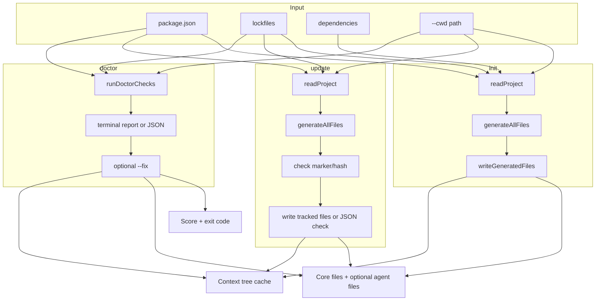

# Tổng quan hệ thống — ready-for-agents

## 1. Định nghĩa

**ready-for-agents** là CLI Node.js giúp repository **sẵn sàng cho AI coding agent** bằng cách:

1. **Quét tĩnh** project (chủ yếu `package.json`, lockfile, folder gốc).
2. **Sinh** hoặc **kiểm tra** các file Markdown context tại root project.
3. **Cache** cấu trúc context dưới dạng tree JSON để agent có thể đọc chọn lọc hơn.

Không gọi API AI. Không quét đệ quy `node_modules` hay toàn bộ cây thư mục.

## 2. Vấn đề giải quyết

| Không có context                     | Có ready-for-agents                   |
| ------------------------------------ | ------------------------------------- |
| Agent đoán npm/pnpm                  | Đọc lockfile + `packageManager`       |
| Agent bịa lệnh build/test            | Dùng script thật trong `package.json` |
| Agent sửa nhầm lockfile              | `AGENTS.md` liệt kê file tránh chỉnh  |
| Mỗi session phải giải thích lại repo | `PROJECT_CONTEXT.md` nằm trong repo   |

## 3. Phạm vi (MVP hiện tại)

### Trong phạm vi

- Project **Node.js** có `package.json` tại root.
- Lệnh `init`: sinh `AGENTS.md`, `PROJECT_CONTEXT.md`, `COMMANDS.md`; tùy chọn `.cursor/rules/ready-for-agents.mdc`, `CLAUDE.md` và `.github/copilot-instructions.md`.
- Lệnh `diff`: so sánh generated context với project hiện tại, không ghi file.
- Lệnh `ci`: sinh GitHub Actions workflow cho readiness và context freshness checks.
- Lệnh `update`: refresh các file context generated sau khi repo đổi.
- Lệnh `doctor`: kiểm tra readiness (11 check khi cwd hợp lệ); `--fix` sửa context files an toàn.
- Lệnh `prompt`: cấu trúc instruction thô thành prompt agent-ready (rule-based).
- Lệnh `config init`: tạo `.ready-for-agents.json` để lưu default project.
- Lệnh `index`: tạo `.ready-for-agents/context-tree.json`.
- Detect: package manager, stack (frontend/backend/database), scripts, folder gốc.
- Ghi file an toàn (`--dry-run`, `--force`).

### Ngoài phạm vi (chưa implement)

- Python / monorepo đa ngôn ngữ.
- Tóm tắt bằng LLM.
- GitHub Action.

## 4. Các lệnh chính



| Lệnh          | Ghi disk?                                 | Mục đích                                          |
| ------------- | ----------------------------------------- | ------------------------------------------------- |
| `init`        | Có (trừ `--dry-run`)                      | Tạo file context lần đầu                          |
| `update`      | Có (trừ `--dry-run`, `--check`, `--json`) | Refresh file context đã sinh                      |
| `doctor`      | Không, trừ khi dùng `--fix`               | Báo thiếu gì và có thể sửa context files an toàn  |
| `prompt`      | Không                                     | Cấu trúc instruction thô thành prompt agent-ready |
| `config init` | Có (trừ `--dry-run`)                      | Tạo config project                                |
| `index`       | Có (trừ `--dry-run`, `--json`)            | Tạo context tree cache                            |

## 5. Đối tượng sử dụng

| Vai trò                  | Dùng tài liệu                                          |
| ------------------------ | ------------------------------------------------------ |
| End user                 | `README.md`                                            |
| Contributor / maintainer | `doc/guide/*`                                          |
| QA / integrator          | `CLI_SPEC.md`, `REQUIREMENTS.md`                       |
| Agent đọc repo target    | File sinh ra (`AGENTS.md`, …) — không phải `doc/guide` |

## 6. Ràng buộc thiết kế cốt lõi

1. **Static only** — mọi quyết định từ file có sẵn trên disk.
2. **Single context object** — `ProjectContext` cho toàn bộ generators.
3. **Safe writes** — không ghi đè file user tự viết; dry-run/check không chạm disk.
4. **Fail-fast cwd** (`doctor`) — path sai → 1 check, không spam warn.
5. **No deep scan** — chỉ `existsSync`/`statSync` tại path cố định.

## 7. Cấu trúc repo (CLI)

```text
ready-for-agents/          # package CLI
├── src/
│   ├── cli.ts              # Entry
│   ├── commands/           # init, update, doctor, prompt, config, index
│   ├── config/             # config reader/defaults
│   ├── doctor/             # checks, score
│   ├── detectors/          # PM, stack, scripts, folders
│   ├── generators/         # Markdown templates + generated marker
│   ├── indexer/            # context tree cache
│   └── fs/                 # read/write/validate
├── tests/
└── doc/guide/              # Đặc tả hệ thống (tài liệu này)
```

## 8. Thứ tự đọc tài liệu

1. [OVERVIEW.md](./OVERVIEW.md) ← bạn đang ở đây
2. [REQUIREMENTS.md](./REQUIREMENTS.md) — yêu cầu + acceptance
3. [CLI_SPEC.md](./CLI_SPEC.md) — giao diện dòng lệnh
4. [DATA_MODEL.md](./DATA_MODEL.md) — types & luồng dữ liệu
5. [ARCHITECTURE.md](./ARCHITECTURE.md) — module & dependency
6. [DETECTION_RULES.md](./DETECTION_RULES.md) — rule detect
7. [GENERATED_FILES_SPEC.md](./GENERATED_FILES_SPEC.md) — template output
8. [SRC_WORKFLOW.md](./SRC_WORKFLOW.md) — map code chi tiết

Tham khảo thêm: [NON_FUNCTIONAL.md](./NON_FUNCTIONAL.md), [TEST_STRATEGY.md](./TEST_STRATEGY.md), [GLOSSARY.md](./GLOSSARY.md), [ROADMAP.md](./ROADMAP.md), [adr/](./adr/).
