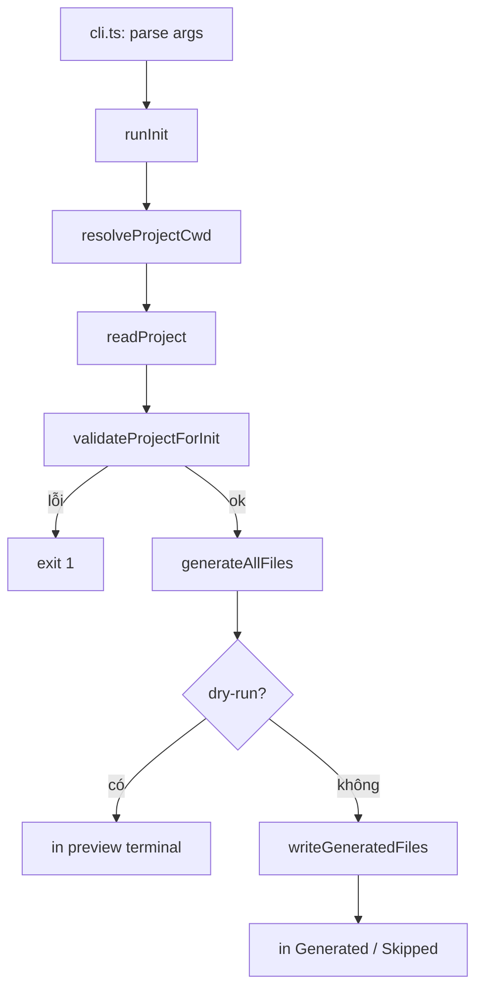
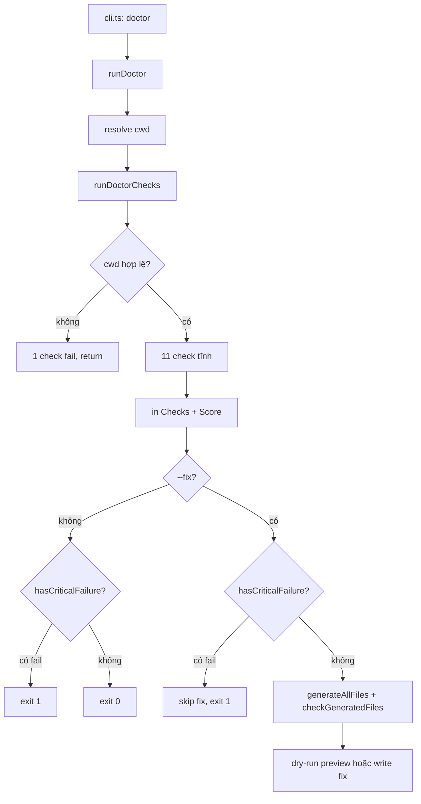
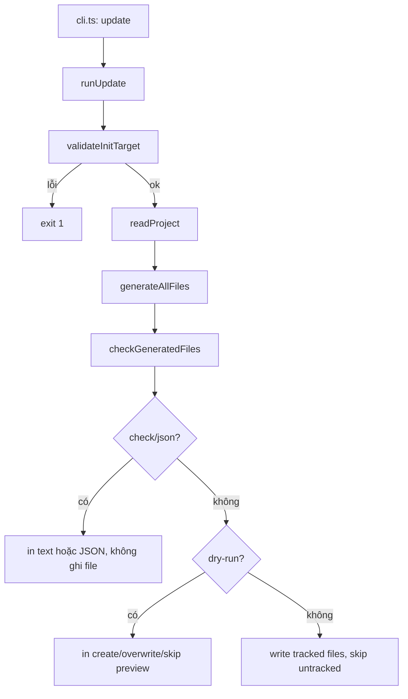

# Workflow và giải thích mã nguồn `src/`

Tài liệu này mô tả **luồng chạy** của CLI `agent-context-kit` và giải thích **từng file / từng hàm** trong thư mục `src/`. Các đoạn khó được giải thích **theo từng dòng**.

---

## Mục lục

1. [Tổng quan workflow](#1-tổng-quan-workflow)
2. [Cấu trúc thư mục](#2-cấu-trúc-thư-mục)
3. [Object trung tâm: `ProjectContext](#3-object-trung-tâm-projectcontext)`
4. [Entry point: `cli.ts`](#4-entry-point-clits)
5. [Lệnh doctor: `doctor/` + `commands/doctor.ts`](#5-lệnh-doctor-doctor--commandsdoctorts)
6. [Lệnh init: `commands/`](#6-lệnh-init-commands)
7. [Lệnh update: `commands/update.ts`](#7-lệnh-update-commandsupdatets)
8. [Đọc / ghi file: `fs/`](#8-đọc--ghi-file-fs)
9. [Detectors: `detectors/`](#9-detectors-detectors)
10. [Generators: `generators/`](#10-generators-generators)
11. [Public API: `index.ts`](#11-public-api-indexts)
12. [Bảng tra cứu nhanh](#12-bảng-tra-cứu-nhanh)
13. [Test cases](#13-test-cases)

---

## 1. Tổng quan workflow

### Lệnh `init`

```bash
pnpm dev init --cwd /path/to/project
# hoặc
pnpm dev init --dry-run --force
```

Luồng xử lý:



**Chi tiết từng bước trong `readProject()`:**

```text
resolve cwd (đường dẫn tuyệt đối)
  → đọc package.json
  → detectPackageManager (lockfile)
  → detectStack (dependencies)
  → detectImportantFolders
  → gom thành ProjectContext
```

**Output:** 3 file tại root project được quét:

- `AGENTS.md` — hướng dẫn cho AI agent
- `PROJECT_CONTEXT.md` — stack, folders, dependencies
- `COMMANDS.md` — lệnh dev/build/test/...

### Lệnh `doctor`

```bash
pnpm dev doctor --cwd /path/to/project
pnpm dev doctor --fix --dry-run --cwd /path/to/project
```

Luồng xử lý:



**Output:** mặc định chỉ in terminal và **không ghi file**. Khi có `--fix`, command tạo/refresh context files an toàn và skip untracked files trừ khi có `--force`.

### Lệnh `update`

```bash
pnpm dev update --cwd /path/to/project
pnpm dev update --check --json --cwd /path/to/project
```

Luồng xử lý:



`update` dùng generated marker ở cuối file để biết file nào do tool sinh ra. Marker phải đúng file và hash phải khớp body hiện tại. File user tự viết hoặc file generated bị sửa tay làm lệch hash được xem là `untracked` và bị skip trừ khi có `--force`.

---

## 2. Cấu trúc thư mục

```text
src/
├── cli.ts                 # Entry CLI (commander)
├── index.ts               # Export public cho thư viện
├── types.ts               # Kiểu dữ liệu trung tâm
├── constants.ts           # Folder bị bỏ qua khi scan
├── commands/
│   ├── init.ts            # Logic lệnh init
│   ├── doctor.ts          # Logic lệnh doctor (in kết quả)
│   └── output.ts          # Format dòng terminal (init)
├── doctor/
│   ├── checks.ts          # runDoctorChecks + các check
│   └── score.ts           # formatScore, hasCriticalFailure
├── fs/
│   ├── read-project.ts    # Đọc package.json + gom context
│   ├── write-files.ts     # Ghi file an toàn
│   ├── validate.ts        # validateCwd, parsePackageJsonRaw
│   └── ignore.ts          # Kiểm tra folder nặng
├── detectors/
│   ├── package-manager.ts
│   ├── stack.ts           # Frontend / backend / database
│   ├── folders.ts
│   ├── scripts.ts         # Script + related dev:*
│   └── labels.ts          # Nhãn hiển thị
└── generators/
    ├── index.ts
    ├── agents-md.ts
    ├── project-context-md.ts
    ├── commands-md.ts
    ├── format.ts
    └── testing-expectations.ts
```

---

## 3. Object trung tâm: `ProjectContext`

File: `src/types.ts`

Đây là **single source of truth** sau khi quét project. Mọi generator chỉ nhận `ProjectContext`, không tự đọc `package.json` lại.

```ts
export type ProjectContext = {
  cwd: string;
  name: string;
  packageManager: PackageManager; // npm | pnpm | yarn | bun
  packageManagerSource: PackageManagerSource; // lockfile | package.json | fallback
  stack: ProjectStack;
  scripts: Record<string, string>;
  folders: string[];
  dependencies: Record<string, string>;
  devDependencies: Record<string, string>;
};
```

`**StackLayer**` — label + evidence:

```ts
export type StackLayer = {
  label: string; // "React/Vite"
  source: string[]; // ["vite", "react"]
};

export type ProjectStack = {
  frontend?: StackLayer;
  backend?: StackLayer;
  database?: StackLayer;
};
```

`**ScriptKey**` — 6 script “chuẩn” dùng cho section trong `COMMANDS.md`:

`dev`, `build`, `test`, `lint`, `typecheck`, `format`

> Lưu ý: `ctx.scripts` chứa **mọi** script; `pickCommonScripts()` mới map 6 key trên.

---

## 4. Entry point: `cli.ts`

### Vai trò

- Đăng ký lệnh `init`, `update`, `doctor`, `prompt` với **commander**
- Truyền options vào `runInit()` / `runUpdate()` / `runDoctor()` / `runPrompt()`
- Thoát process với mã `0` (ok) hoặc `1` (lỗi)

### `getVersion()`

Đọc `package.json` cạnh thư mục `dist/` để hiển thị `--version`.

```ts
const pkgPath = join(__dirname, "..", "package.json");
```

- `__dirname` = thư mục chứa `cli.js` sau build (`dist/`)
- `..` = root package → lấy field `version`

### Lệnh `init`

| Option         | Ý nghĩa                                      |
| -------------- | -------------------------------------------- |
| `--dry-run`    | Chỉ in preview, **không** `writeFileSync`    |
| `--force`      | Ghi đè file đã tồn tại                       |
| `--cwd <path>` | Project cần quét (mặc định: `process.cwd()`) |

### Lệnh `update`

| Option         | Ý nghĩa                                              |
| -------------- | ---------------------------------------------------- |
| `--dry-run`    | Preview file sẽ tạo/overwrite/skip, không ghi disk   |
| `--check`      | Kiểm tra selected generated files đã up to date chưa |
| `--json`       | In `UpdateCheckJsonOutput`, không ghi disk           |
| `--force`      | Ghi đè untracked files nếu user chủ động muốn        |
| `--cursor`     | Include `.cursor/rules/agent-context-kit.mdc`        |
| `--claude`     | Include `CLAUDE.md`                                  |
| `--all`        | Include toàn bộ optional agent files                 |
| `--cwd <path>` | Project cần cập nhật (mặc định: `process.cwd()`)     |

### Lệnh `doctor`

| Option         | Ý nghĩa                                          |
| -------------- | ------------------------------------------------ |
| `--cwd <path>` | Project cần kiểm tra (mặc định: `process.cwd()`) |
| `--json`       | In JSON machine-readable                         |
| `--fix`        | Tạo/refresh context files an toàn                |
| `--dry-run`    | Với `--fix`, preview mà không ghi disk           |
| `--force`      | Với `--fix`, overwrite untracked files           |
| `--cursor`     | Với `--fix`, include Cursor rules                |
| `--claude`     | Với `--fix`, include `CLAUDE.md`                 |
| `--all`        | Với `--fix`, include toàn bộ optional files      |

Không truyền `--fix` thì `doctor` không ghi file.

**Lưu ý:** `--cwd` phải là **đường dẫn**, không gõ `cd/...`:

```bash
# Sai
--cwd cd/Users/.../project

# Đúng
--cwd /Users/.../project
```

---

## 5. Lệnh doctor: `doctor/` + `commands/doctor.ts`

### `commands/doctor.ts` — `runDoctor(options)`

| Bước | Code                                    | Giải thích                                |
| ---- | --------------------------------------- | ----------------------------------------- |
| 1    | `resolve(options.cwd ?? process.cwd())` | Chuẩn hóa path tuyệt đối                  |
| 2    | `runDoctorChecks(cwd)`                  | Chạy toàn bộ check (sync)                 |
| 3    | `options.fix ? runDoctorFix(...) : ...` | Chọn report-only hoặc fix flow            |
| 4    | In từng dòng `formatCheckLine`          | ✓ pass / ! warn / ✗ fail (+ `detail` dim) |
| 5    | `formatScore(result)`                   | `Score: 6/11 · 4 warnings · 0 failures`   |
| 6    | `hasCriticalFailure(result) ? 1 : 0`    | Có bất kỳ check `fail` → exit 1           |

### `doctor --fix`

| Bước | Code                                         | Giải thích                                                   |
| ---- | -------------------------------------------- | ------------------------------------------------------------ |
| 1    | `runDoctorChecks(cwd)`                       | Luôn check trước                                             |
| 2    | `hasCriticalFailure(result)`                 | Nếu có fail critical → không fix                             |
| 3    | `readProject(cwd)` + `generateAllFiles(...)` | Sinh output hiện tại                                         |
| 4    | `checkGeneratedFiles(cwd, files)`            | Phân loại `missing/outdated/untracked/upToDate`              |
| 5a   | `--dry-run`                                  | In preview, không ghi disk                                   |
| 5b   | write mode                                   | Ghi `missing/outdated`, skip `untracked` nếu không `--force` |

### `doctor/checks.ts` — `runDoctorChecks(cwd)`

**Dừng sớm** (chỉ 1 check, không chạy tiếp):

| Điều kiện             | Label                              | Detail                            |
| --------------------- | ---------------------------------- | --------------------------------- |
| `!existsSync(cwd)`    | `Project directory found`          | `` `${cwd} does not exist` ``     |
| `!stat.isDirectory()` | `Project directory is a directory` | `` `${cwd} is not a directory` `` |

**Khi cwd hợp lệ** (11 check):

1. `Project directory found` — pass
2. `package.json found` — fail nếu thiếu
3. `package.json is valid JSON` — fail nếu parse lỗi (`parsePackageJsonRaw`)
4. Package manager — pass nếu lockfile/field; **warn** nếu npm fallback
5. `AGENTS.md` — **warn** nếu thiếu
6. `PROJECT_CONTEXT.md` — **warn** nếu thiếu
7. `COMMANDS.md` — **warn** nếu thiếu
8. `dev` script — **warn** nếu thiếu
9. `build` script — **warn** nếu thiếu
10. `test` script — **warn** nếu thiếu
11. `README.md` — **warn** nếu thiếu

Tái sử dụng `resolvePackageManager` (detectors) — không quét `node_modules`, không đọc đệ quy repo.

### `doctor/score.ts`

- `formatScore` — chuỗi score + đếm warnings/failures
- `hasCriticalFailure` — `result.failed > 0`

---

## 6. Lệnh init: `commands/`

### `commands/init.ts` — `runInit(options)`

Hàm **điều phối chính** của lệnh `init`.

| Bước | Code                              | Giải thích                      |
| ---- | --------------------------------- | ------------------------------- |
| 1    | `resolveProjectCwd(options.cwd)`  | Chuẩn hóa path tuyệt đối        |
| 2    | `readProject(cwd)`                | Tạo `ProjectContext`            |
| 3    | `validateProjectForInit(ctx)`     | Bắt buộc có `package.json`      |
| 4    | `generateAllFiles(ctx)`           | Sinh nội dung 3 file            |
| 5    | In `formatDetectedSummary`        | Block "Detected:" trên terminal |
| 6a   | `dryRun` → `printDryRunPreview`   | Không ghi disk                  |
| 6b   | ngược lại → `writeGeneratedFiles` | Ghi an toàn                     |

**Exit code:**

- `1` — không có `package.json`
- `0` — thành công (kể cả khi skip hết file vì đã tồn tại)

### `printDryRunPreview(cwd, files, force)`

Mô phỏng hành vi ghi file **không** chạm disk:

1. `getExistingOutputFiles(cwd)` — file nào đã có
2. Chia `wouldWrite` / `wouldSkip` (giống logic `writeGeneratedFiles`)
3. In nội dung đầy đủ từng file Markdown

### `commands/output.ts`

| Hàm                             | Output ví dụ                                             |
| ------------------------------- | -------------------------------------------------------- |
| `formatDetectedSummary(ctx)`    | `Detected:` + Project, PM, Framework, Database?, Scripts |
| `formatGeneratedLines(written)` | `Generated:` + danh sách file                            |
| `formatSkippedLines(skipped)`   | `Skipped:` + "... Use --force to overwrite."             |
| `formatDryRunNotice()`          | `Dry run — no files written.`                            |

`**formatScriptListForTerminal`** (trong `detectors/scripts.ts`) được gọi để liệt kê script, **bao gồm\*\* `dev:client`, `dev:server` nếu có.

---

## 7. Lệnh update: `commands/update.ts`

### `runUpdate(options)`

| Bước | Code                              | Giải thích                                                   |
| ---- | --------------------------------- | ------------------------------------------------------------ |
| 1    | `validateInitTarget(options.cwd)` | Reuse validation của `init`                                  |
| 2    | `readProject(cwd)`                | Tạo `ProjectContext` mới nhất                                |
| 3    | `generateAllFiles(ctx, presets)`  | Sinh core/optional files có marker                           |
| 4    | `checkGeneratedFiles(cwd, files)` | Phân loại `upToDate`, `outdated`, `missing`, `untracked`     |
| 5a   | `--check` / `--json`              | In result, không ghi file                                    |
| 5b   | `--dry-run`                       | Preview create/overwrite/skip                                |
| 5c   | write mode                        | Ghi file tracked/missing, skip untracked nếu không `--force` |

### `checkGeneratedFiles(cwd, files)`

| Trạng thái  | Điều kiện                                                   |
| ----------- | ----------------------------------------------------------- |
| `upToDate`  | File tồn tại và nội dung khớp output mới                    |
| `outdated`  | File tồn tại, có generated marker hợp lệ, nhưng nội dung cũ |
| `missing`   | File chưa tồn tại                                           |
| `untracked` | File tồn tại nhưng không có generated marker hợp lệ         |

`ok === true` khi không có `outdated`, `missing`, `untracked`.

### `writeUpdateFiles(cwd, files, { force })`

Tạo file missing, overwrite file tracked, và bảo vệ file user tự viết:

| Tình huống                             | Kết quả                       |
| -------------------------------------- | ----------------------------- |
| File chưa có                           | `Generated:`                  |
| File có marker hợp lệ                  | `Overwritten:`                |
| File có nhưng không marker             | `Skipped untracked:` + exit 1 |
| File có nhưng không marker + `--force` | `Overwritten:`                |

---

## 8. Đọc / ghi file: `fs/`

### `fs/read-project.ts`

#### `resolveProjectCwd(cwd?)`

```ts
return resolve(cwd ?? process.cwd());
```

- `path.resolve` biến path tương đối thành **absolute**
- Nếu không truyền `cwd` → dùng thư mục hiện tại của terminal

#### `readPackageJson(cwd)` (private)

| Dòng                          | Ý nghĩa                                                  |
| ----------------------------- | -------------------------------------------------------- |
| `join(cwd, "package.json")`   | Path file cấu hình Node                                  |
| `existsSync`                  | Không có file → trả object rỗng, `hasPackageJson: false` |
| `readFileSync` + `JSON.parse` | Đọc và parse JSON                                        |
| `parsed.name ?? "unknown"`    | Fallback tên project                                     |

#### `validateInitTarget(cwdInput?)` — validation trước init

Gọi **trước** khi generate. Kiểm tra:

| Kiểm tra           | Lỗi ví dụ                                      |
| ------------------ | ---------------------------------------------- |
| `cwd` tồn tại      | `Directory does not exist: ...`                |
| `cwd` là directory | `Not a directory: ...`                         |
| Có `package.json`  | `No package.json found at ...`                 |
| JSON hợp lệ        | `Invalid package.json (JSON parse error): ...` |
| Root là object     | `expected an object`                           |

File: `src/fs/validate.ts`

#### `readProject(cwdInput?)` — **hàm quan trọng nhất**

```ts
const { manager, source } = resolvePackageManager(cwd, pkg.packageManagerField);
const stack = detectStack(pkg.dependencies, pkg.devDependencies);
```

- Package manager: **lockfile → `package.json` `packageManager` → npm fallback**
- `packageManagerSource`: `"lockfile"` | `"package.json"` | `"fallback"`
- `stack.`\* có `{ label, source: string[] }` — evidence từ dependencies
- `scripts` = nguyên bản từ `package.json`

#### `hasReadme(cwd)`

Kiểm tra `README.md` hoặc `README.MD` — dùng trong generator (gợi ý đọc README).

---

### `fs/write-files.ts`

#### `getExistingOutputFiles(cwd)`

Lọc trong `OUTPUT_FILES` (`AGENTS.md`, `PROJECT_CONTEXT.md`, `COMMANDS.md`) — file nào `existsSync` thì có trong danh sách.

#### `writeGeneratedFiles(cwd, files, { force })`

**Hành vi an toàn:**

| Tình huống               | Kết quả terminal | `WriteResult`   |
| ------------------------ | ---------------- | --------------- |
| File chưa có             | `Generated:`     | `created[]`     |
| File có + `--force`      | `Overwritten:`   | `overwritten[]` |
| File có, không `--force` | `Skipped:`       | `skipped[]`     |

`--dry-run` dùng `planWriteActions()` → `Would generate` / `Would overwrite` / `Skipped`.

---

### `fs/ignore.ts` + `constants.ts`

```ts
export const IGNORED_SCAN_DIRS = new Set([
  "node_modules",
  ".git",
  "dist",
  "build",
  ".next",
  "coverage",
]);
```

`isIgnoredDirectory(name)` — hiện dùng khi detect folder (tránh nhầm folder nặng). MVP **không** quét đệ quy toàn repo; chỉ `existsSync` từng tên trong `IMPORTANT_FOLDERS` ở root.

---

## 9. Detectors: `detectors/`

### `package-manager.ts` — `resolvePackageManager(cwd, field)`

**Thứ tự ưu tiên:**

```text
lockfile → package.json "packageManager" → npm (fallback)
```

| Bước     | Ví dụ                                   |
| -------- | --------------------------------------- |
| Lockfile | `pnpm-lock.yaml` → pnpm                 |
| Field    | `"packageManager": "pnpm@9.0.0"` → pnpm |
| Fallback | không có gì → npm `(fallback)`          |

---

### `stack.ts` — detect full-stack

#### Cơ chế rule

Mỗi layer có mảng rule `{ deps: string[], label: string }`:

- **Frontend:** `next` → Next.js; `vite` + `react` → React/Vite; ...
- **Backend:** `@nestjs/core` → NestJS; `express` → Express; ...
- **Database:** `mongoose` → MongoDB/Mongoose; `pg` → PostgreSQL; ...

#### `hasDeps(all, names)`

```ts
return names.every((name) => all[name] !== undefined);
```

Tất cả package trong rule phải có trong `dependencies` hoặc `devDependencies`.

#### `pickLayer(all, rules)`

Trả `StackLayer | undefined`:

```ts
{ label: "React/Vite", source: ["vite", "react"] }
```

`PROJECT_CONTEXT.md` in `_Detected from dependencies:_ \`vite, react`.

#### `detectStack(deps, devDeps)`

Gộp deps → detect **đồng thời** cả 3 layer.

**Ví dụ** `vite`, `react`, `express`, `mongoose`:

```ts
{
  frontend: { label: "React/Vite", source: ["vite", "react"] },
  backend: { label: "Express", source: ["express"] },
  database: { label: "MongoDB/Mongoose", source: ["mongoose"] }
}
```

#### `stackFrameworkSummary(stack)`

```ts
[stack.frontend, stack.backend].filter(Boolean).join(" + ");
// → "React/Vite + Express"
```

Không có layer nào → `"Node.js"`.

---

### `folders.ts` — `detectImportantFolders(cwd)`

Với mỗi tên trong `IMPORTANT_FOLDERS` (`src`, `app`, `pages`, ...):

1. Bỏ qua nếu tên nằm trong `IGNORED_SCAN_DIRS`
2. `existsSync` + `statSync.isDirectory()`
3. Push vào mảng `found`

---

### `scripts.ts` — xử lý script phức tạp

#### `SCRIPT_ALIASES`

Map logical key → tên script thực trong `package.json`:

```ts
dev: ["dev", "start:dev", "develop"];
typecheck: ["typecheck", "type-check", "check:types"];
```

#### `pickCommonScripts(packageScripts)`

Với mỗi `ScriptKey`, tìm alias đầu tiên tồn tại → trả:

```ts
{ scriptName: "dev", command: "concurrently ..." }
```

#### `parseScriptRefsFromCommand(command)` — parser cứng hơn

Chỉ bắt dạng chạy script rõ ràng:

```text
npm run <script>
pnpm run <script>
bun run <script>
yarn run <script>
yarn <script>   (trừ add, install, remove, upgrade, ...)
```

**Không** bắt `pnpm install`, `yarn add`, `bun install` nhầm thành script.

**Ví dụ input:**

```json
"dev": "concurrently \"npm run dev:client\" \"npm run dev:server\""
```

**Output:** `["dev:client", "dev:server"]`

```ts
for (const match of command.matchAll(SCRIPT_REF_RE)) {
  found.add(match[1]);
}
```

#### `findRelatedScripts(packageScripts, baseKey)`

Gom 2 nguồn:

1. Script tên `dev:*` (prefix `dev:`)
2. Script được reference trong lệnh `dev` chính

Loại trừ tên script `dev` chính (tránh trùng).

#### `runScriptCommand(packageManager, scriptName)`

| PM           | Lệnh sinh ra  |
| ------------ | ------------- |
| pnpm         | `pnpm dev`    |
| yarn         | `yarn dev`    |
| bun          | `bun run dev` |
| npm fallback | `npm run dev` |

#### `relatedScriptsSection(pm, scriptNames)`

Tạo block Markdown `## Related Development Scripts` + khối bash các lệnh con.

---

### `labels.ts`

Chuyển giá trị machine → text cho human/terminal:

- `"unknown"` → `"Not detected"`
- `stack` rỗng → Framework `"Not detected"`

---

## 10. Generators: `generators/`

Generators nhận `ProjectContext`, trả **chuỗi Markdown**. Không side-effect (không ghi file).

### `generators/index.ts` — `generateAllFiles(ctx)`

```ts
const files = {
  "AGENTS.md": generateAgentsMd(ctx),
  "PROJECT_CONTEXT.md": generateProjectContextMd(ctx),
  "COMMANDS.md": generateCommandsMd(ctx),
};
return addGeneratedMarkers(files);
```

---

### `generators/marker.ts`

Thêm và đọc marker cuối file:

```md
<!-- agent-context-kit:generated file="AGENTS.md" hash="abcdef1234567890" -->
```

| Hàm                                  | Vai trò                                       |
| ------------------------------------ | --------------------------------------------- |
| `withGeneratedMarker(file, content)` | Strip marker cũ, tính hash mới, append marker |
| `stripGeneratedMarker(content)`      | Bỏ marker để tính hash/body                   |
| `readGeneratedMarker(content)`       | Parse marker nếu có                           |
| `hasGeneratedMarker(content, file)`  | Kiểm tra marker đúng output file              |

`update` dùng marker này để không ghi đè file user tự viết.

### `generators/format.ts`

**Vấn đề:** Markdown cần dòng trống sau heading trước list.

```ts
// Sai (list dính heading):
Important folders:
- `src/`

// Đúng:
Important folders:

- `src/`
```

`formatBulletList` → `\n\n` + các dòng `- item`.

`formatFolderBullets` → bọc folder dạng `src/`.

---

### `generators/agents-md.ts`

| Phần                 | Nguồn dữ liệu                       |
| -------------------- | ----------------------------------- |
| Project Goal         | `ctx.name`, `stackFrameworkDisplay` |
| Package manager      | `packageManagerLabel`               |
| Framework / Database | `stackLinesForAgents`               |
| Important folders    | `formatFolderBullets`               |
| Testing              | `formatTestingExpectations`         |

`stackLinesForAgents` — chỉ in Database nếu `stack.database` có giá trị.

---

### `generators/project-context-md.ts`

- **Stack:** 3 subsection Frontend / Backend / Database
- **Summary:** một dòng tóm tắt
- **Dependencies:** tối đa 15 package, phần còn lại `…and N more`
- **Notes:** README thiếu, PM fallback, hoặc “Generated by agent-context-kit init”

---

### `generators/commands-md.ts`

#### `sectionForScript(ctx, title, scriptKey)`

1. `pickCommonScripts` — không có → section "Not detected"
2. Có → in script gốc + lệnh chạy (`runScriptCommand`)
3. Nếu `scriptKey === "dev"` → append `relatedScriptsSection`

#### `installBlock(pm)`

Lệnh cài dependency theo đúng package manager.

---

### `generators/testing-expectations.ts`

Logic ưu tiên:

```text
Có script test?
  → yes: hướng dẫn chạy test
  → no: có script build?
      → yes: gợi ý dùng `npm run build` (hoặc pnpm/yarn tương ứng) làm baseline
      → no: hỏi user cách verify
```

---

## 11. Public API: `index.ts`

Re-export cho ai `import` package như thư viện:

- `runInit`, `runUpdate`, `checkGeneratedFiles`, `writeUpdateFiles`, `runDoctor`, `readProject`, `generateAllFiles`
- `runDoctorChecks`, `formatScore`, `hasCriticalFailure`
- Types: `DoctorCheck`, `DoctorResult`, `ProjectContext`, ...
- Các detector: `detectStack`, `resolvePackageManager`, ...

CLI production dùng `dist/cli.js`; `index.ts` phục vụ test và tích hợp programmatic.

---

## 12. Bảng tra cứu nhanh

| Câu hỏi                         | File / hàm                                    |
| ------------------------------- | --------------------------------------------- |
| User chạy lệnh ở đâu?           | `cli.ts`                                      |
| Logic init chính?               | `commands/init.ts` → `runInit`                |
| Logic update chính?             | `commands/update.ts` → `runUpdate`            |
| Check file generated hiện tại?  | `commands/update.ts` → `checkGeneratedFiles`  |
| Logic doctor chính?             | `commands/doctor.ts` → `runDoctor`            |
| Logic doctor fix?               | `commands/doctor.ts` → `runDoctorFix`         |
| Các check doctor?               | `doctor/checks.ts` → `runDoctorChecks`        |
| cwd sai, dừng sớm?              | đầu `runDoctorChecks` (`existsSync` / `stat`) |
| Tạo object project?             | `fs/read-project.ts` → `readProject`          |
| Detect React + Express + Mongo? | `detectors/stack.ts` → `detectStack`          |
| Detect pnpm vs npm?             | `detectors/package-manager.ts`                |
| `dev:client` / `dev:server`?    | `detectors/scripts.ts` → `findRelatedScripts` |
| Sinh AGENTS.md?                 | `generators/agents-md.ts`                     |
| Marker generated file?          | `generators/marker.ts`                        |
| Không ghi đè file?              | `fs/write-files.ts` + flag `--force`          |
| Chỉ xem trước?                  | `runInit({ dryRun: true })`                   |
| Format terminal Detected?       | `commands/output.ts`                          |
| Format score doctor?            | `doctor/score.ts` → `formatScore`             |

---

## 13. Test cases

Chạy: `pnpm test` (247 tests trong `tests/`, gồm `doctor.test.ts`, `generators.test.ts`, `init-safety.test.ts`, `update.test.ts`, `prompt.test.ts`, `prompt-examples.test.ts`, `prompt-quality.test.ts`).

| Case                                              | Kỳ vọng                                               |
| ------------------------------------------------- | ----------------------------------------------------- |
| Không có `package.json`                           | `validateInitTarget` / `runInit` → exit 1, message rõ |
| `package.json` JSON hỏng                          | `JSON parse error`                                    |
| `cwd` không tồn tại                               | `Directory does not exist`                            |
| `--dry-run`                                       | Không tạo file trên disk                              |
| File tồn tại, không `--force`                     | `Skipped:`                                            |
| File tồn tại + `--force`                          | `Overwritten:`                                        |
| `update`: file generated cũ                       | `Overwritten:`                                        |
| `update`: file user tự viết hoặc hash marker lệch | `Skipped untracked:` + exit 1                         |
| `update --check --json`                           | JSON parseable với `missing/outdated/untracked`       |
| React/Vite + Express + Mongoose                   | Full stack + `source`                                 |
| `dev` gọi `dev:client` / `dev:server`             | Related scripts trong COMMANDS.md                     |
| `pnpm install` trong script                       | Không bắt nhầm là script name                         |
| PM: lockfile ưu tiên hơn field                    | `resolvePackageManager` tests                         |
| Không lockfile, có `"packageManager": "pnpm@9"`   | PM từ package.json                                    |
| `doctor`: cwd không tồn tại                       | 1 check fail, label `Project directory found`         |
| `doctor`: cwd là file                             | 1 check fail, `Project directory is a directory`      |
| `doctor`: thiếu context files                     | `warn`, exit 0                                        |
| `doctor`: thiếu `package.json`                    | `fail`, exit 1                                        |
| `doctor --fix`: thiếu context files               | tạo file generated còn thiếu                          |
| `doctor --fix --dry-run`                          | preview fix, không ghi disk                           |
| `doctor --fix`: file user tự viết                 | skip untracked, exit 1                                |

---

## Phụ lục: Chạy và debug

```bash
# Dev (TypeScript trực tiếp)
pnpm dev init --dry-run
pnpm dev init --cwd /absolute/path/to/project
pnpm dev doctor --cwd /absolute/path/to/project

# Test
pnpm test

# Build + chạy bản compile
pnpm build
pnpm start init --dry-run
pnpm start doctor --cwd /absolute/path/to/project
```

Khi debug, đặt breakpoint tại:

1. `readProject` — xem `ProjectContext` sau detect
2. `generateAllFiles` — xem Markdown trước khi ghi
3. `writeGeneratedFiles` — xem `created` vs `overwritten` vs `skipped`

---

_Tài liệu sinh cho codebase `agent-context-kit` v0.1.x — đã có `init` + `update` + `doctor` + `prompt`; cập nhật khi thêm command hoặc hỗ trợ ngôn ngữ khác._
